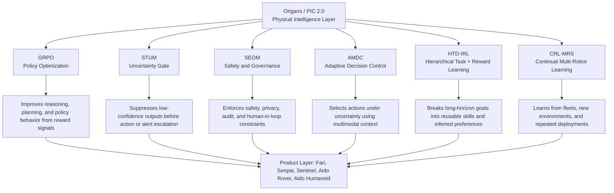

# PIC 2.0 Conceptual Map: Six Foundation-Model Components

**Product Anchor:** Origami / PIC 2.0   
**Scope:** One-page conceptual map using public InGen materials plus open-literature equivalents

---

## 1. Interpretation

InGen describes **Origami AI / PIC 2.0** as a physical intelligence platform: a shared, hardware-agnostic, edge-native, multimodal intelligence layer intended to power multiple robot and automation products rather than a single standalone device. Public InGen materials describe Origami AI as “the shared intelligence layer powering every InGen product,” with product links across Aido, Fari, Senpai, Sentinel, Carry & Go, Rover, and Humanoid. InGen also frames the platform as a single physical intelligence layer that compounds value across products, with modules spanning hardware, deep learning, software, and intelligence.

---

## 2. Conceptual Stack

---

## 3. Six-Component Map

| PIC 2.0 Component | Interpreted Role in Physical AI | Public InGen Signal | Open-Literature Equivalent | Practical Product Meaning |
|---|---|---|---|---|
| **GRPO** | Reward-based policy optimization for reasoning, planning, or decision models | Not fully specified in public InGen pages found; treated here as a PIC 2.0 model label mapped to open literature | **Group Relative Policy Optimization** from DeepSeekMath, a PPO-style RL method that removes the critic model and estimates a baseline from group scores | Useful for improving decision policies when rewards are verifiable or judgeable, such as scenario correctness, route choice, task completion, or safe escalation |
| **STUM** | Uncertainty estimation and confidence gating | Sentinel Prime AI describes **STUM** as a probabilistic uncertainty gate using MC-Dropout and ECE-style calibration; uncertain detections are suppressed before becoming alerts | Bayesian uncertainty approximation using Monte Carlo Dropout; confidence calibration and Expected Calibration Error | Reduces false alerts, supports “do not act when uncertain,” and creates confidence-aware outputs for Sentinel, Rover, Fari, and Senpai |
| **SEOM** | Safety, ethics, governance, and runtime constraint enforcement | Sentinel Prime AI describes **SEOM Governance** as hardware-enforced safety rules, human override, auditability, and EU AI Act Article 9 alignment | Runtime assurance, safety shields, constrained policy execution, AI risk management | Keeps AI advisory rather than uncontrolled; enforces human-in-loop, escalation ladders, privacy zones, audit logging, and fail-safe behavior |
| **AMDC** | Adaptive multimodal decision control under changing context | Sentinel Prime AI mentions calibrated AMDC transforms for sensor alignment; the internship plan uses AMDC for adaptive decision behavior across Fari, Senpai, Sentinel, and Aido Rover scenarios | POMDP-style decision-making under uncertainty, behavior trees, adaptive model predictive control, and multimodal sensor fusion | Converts perception and uncertainty into action choices: escalate, suppress, reroute, ask a human, switch mode, or continue monitoring |
| **HTD-IRL** | Long-horizon task decomposition plus learning preferences or rewards from demonstrations | Treated as a PIC 2.0 model label in the internship plan rather than a public product specification | Hierarchical reinforcement learning, options framework, task decomposition, inverse reinforcement learning | Lets robots decompose goals like “inspect this area,” “support this student,” or “assist this elder” into reusable subskills and inferred priorities |
| **CRL-MRS** | Continual learning across multiple robots, deployments, and environments | Treated as a PIC 2.0 model label in the internship plan rather than a public product specification | Continual reinforcement learning, lifelong learning, cooperative multi-agent RL, multi-robot systems | Turns fleet experience into platform learning: repeated patrols, failures, alerts, user interactions, and new sites can improve future deployments |

---

## 4. How the Components Fit Together

The six components should be read as a layered operating model rather than six isolated algorithms.

**GRPO** improves policy behavior from feedback. **HTD-IRL** gives structure to long-horizon tasks by decomposing them into subgoals and learning what users or operators value. **AMDC** acts as the online decision layer that chooses the next action from multimodal context. **STUM** adds uncertainty awareness before a decision becomes an alert or action. **SEOM** enforces safety, compliance, human oversight, and auditability. **CRL-MRS** closes the loop by learning across repeated deployments, robots, and environments.

The resulting PIC 2.0 logic is:

> perceive multimodally → estimate uncertainty → decompose task → choose action → enforce safety → learn from deployment.

This interpretation fits InGen’s public platform narrative: one shared intelligence architecture across multiple products, with each product creating data and lessons that should strengthen the others.

---

## 5. Product Anchoring

| Product Anchor | Most Relevant PIC 2.0 Components | Why |
|---|---|---|
| **Sentinel Prime AI** | STUM, SEOM, AMDC | Confidence-gated alerts, human-in-loop escalation, governance, multimodal sensor fusion, audit trail |
| **Aido Rover** | AMDC, HTD-IRL, CRL-MRS, STUM | Patrol routing, anomaly response, sensor uncertainty, fleet learning, multi-site adaptation |
| **Fari** | AMDC, SEOM, HTD-IRL | Companion decision branching, user safety, escalation to caregivers, preference learning |
| **Senpai** | AMDC, HTD-IRL, GRPO | Adaptive tutoring, task sequencing, feedback-based improvement, student-centered branching |
| **Aido Humanoid** | HTD-IRL, CRL-MRS, AMDC, SEOM | Long-horizon manipulation, whole-body task decomposition, safe runtime constraints, transfer across embodiments |
| **Origami Platform** | All six | Shared intelligence layer that can reuse perception, control, uncertainty, safety, and learning modules across product lines |

---

## 6. Analyst Takeaway

The key strategic idea is that PIC 2.0 should not be evaluated as a single model. It is better understood as a **physical intelligence control stack**. The open-literature equivalents suggest what each layer should prove:

- GRPO: policy improvement from reward or preference signals
- STUM: calibrated uncertainty and confidence-aware suppression
- SEOM: safety, governance, and runtime constraints
- AMDC: adaptive decision-making under multimodal uncertainty
- HTD-IRL: long-horizon skill decomposition and reward inference
- CRL-MRS: continual learning across robot fleets and environments

---

## References

1. InGen Dynamics, “InGen Dynamics — Robotics & AI for Humanity.”  
   https://www.ingendynamics.com/

2. InGen Dynamics, “Sentinel Prime AI · Enterprise Physical Security Intelligence.”  
   https://ingendynamics.com/sentinel.html

3. Shao et al., “DeepSeekMath: Pushing the Limits of Mathematical Reasoning in Open Language Models,” 2024.  
   https://arxiv.org/abs/2402.03300

4. Gal and Ghahramani, “Dropout as a Bayesian Approximation: Representing Model Uncertainty in Deep Learning,” 2015.  
   https://arxiv.org/abs/1506.02142

5. Guo et al., “On Calibration of Modern Neural Networks,” 2017.  
   https://arxiv.org/abs/1706.04599

6. Hutsebaut-Buysse, Mets, and Latré, “Hierarchical Reinforcement Learning: A Survey and Open Research Challenges,” 2022.  
   https://www.mdpi.com/2504-4990/4/1/9

7. Arora and Doshi, “A Survey of Inverse Reinforcement Learning: Challenges, Methods and Progress,” 2018.  
   https://arxiv.org/abs/1806.06877

8. Lauri, Hsu, and Pajarinen, “Partially Observable Markov Decision Processes in Robotics: A Survey,” 2022.  
   https://arxiv.org/abs/2209.10342

9. Iovino et al., “A Survey of Behavior Trees in Robotics and AI,” 2020.  
   https://arxiv.org/abs/2005.05842

10. Orr and Dutta, “Multi-Agent Deep Reinforcement Learning for Multi-Robot Applications: A Survey,” 2023.  
    https://www.mdpi.com/1424-8220/23/7/3625

11. EU Artificial Intelligence Act, Article 9: Risk Management System.  
    https://artificialintelligenceact.eu/article/9/
