# Physical AI Landscape Brief

**Product Anchor:** Origami / PIC 2.0, cross-portfolio orientation  
**Scope:** Five anchor readings plus ecosystem map

---

## 1. Reading 1: OpenVLA and the Rise of Open Vision-Language-Action Models

**Reference:** *OpenVLA: An Open-Source Vision-Language-Action Model*  
**Core question:** Can an open VLA model become a practical base policy for generalist robot manipulation?

OpenVLA is one of the most important current references because it shifts VLA research from closed demonstrations toward open reproducibility. The paper introduces a 7B-parameter open-source VLA trained on 970K real-world robot demonstrations. It combines a Llama 2 language model with visual features from DINOv2 and SigLIP, then connects this perception-language backbone to action prediction for robotic manipulation. The paper reports that OpenVLA outperforms RT-2-X by 16.5 percentage points in absolute task success across 29 tasks and multiple robot embodiments, with fewer parameters.

The strategic importance is not just performance. It is accessibility. Earlier VLA work such as RT-2 demonstrated that web-scale vision-language knowledge could transfer into robotic control, but much of that capability was locked inside large proprietary systems. OpenVLA changes the analyst's baseline. A small robotics company can now study, fine-tune, and benchmark a serious VLA model without depending entirely on closed models.

For InGen, OpenVLA gives a useful comparison point for Origami / PIC 2.0. If Origami is positioned as a physical intelligence platform, the relevant question is not "Does it use AI?" The sharper question is: what capabilities are reusable across bodies and tasks? OpenVLA suggests several evaluation dimensions:

- **Data coverage:** how many embodiments, tasks, sensor configurations, and action spaces are represented?
- **Fine-tuning efficiency:** can the model adapt to a new product scenario without large-scale retraining?
- **Deployment efficiency:** can inference run under product constraints, not only in a lab?
- **Action representation:** does the system output discrete action tokens, continuous controls, or a hybrid?
- **Evidence quality:** are results reported across held-out tasks, novel objects, and multiple embodiments?

The main limitation is that OpenVLA is still primarily a manipulation-centered model. It is a strong anchor for tabletop, arm-based, and language-conditioned manipulation, but it does not by itself solve full-body humanoid locomotion, long-horizon autonomy, fleet operations, or safety-critical monitoring. For InGen, this means OpenVLA is best treated as a foundation-model benchmark, not a full physical AI solution.

---

## 2. Reading 2: Figure Helix and Humanoid Foundation-Model Control

**Reference:** *Helix: A Vision-Language-Action Model for Generalist Humanoid Control*  
**Core question:** What does a humanoid-oriented foundation model need beyond a standard VLA?

Figure's Helix is a useful humanoid anchor because it directly addresses the gap between semantic generalization and high-frequency robot control. Helix is presented as a System 1, System 2 VLA for full upper-body humanoid control. Figure describes System 2 as an onboard internet-pretrained VLM running at 7 to 9 Hz for scene understanding and language comprehension. System 1 is a fast reactive visuomotor policy translating System 2's latent representations into continuous robot actions at 200 Hz.

This architecture is strategically important because humanoids face a harder control problem than tabletop manipulators. A humanoid upper body has hands, wrists, arms, torso, and head movement, and changes in torso or head posture also change what the robot can see and reach. Figure reports that Helix coordinates a 35-DoF action space at 200 Hz and demonstrates multi-robot coordination using the same model weights.

The stronger insight is architectural: humanoid autonomy is unlikely to be a single monolithic model operating at one frequency. The physical world has multiple time scales. Language and task intent can update slowly. Balance, grasp correction, collision avoidance, and fine motor control must update quickly. This maps well to a layered physical AI stack:

- slow semantic reasoning,
- medium-horizon task planning,
- fast visuomotor control,
- hardware-level safety constraints,
- telemetry-based monitoring.

Helix also makes a useful point about data economics. Figure reports training Helix with about 500 hours of high-quality supervised data and one unified set of weights across diverse behaviors. That claim should be read carefully because it is a company technical post rather than a peer-reviewed benchmark. Still, the direction is credible: strong model design and high-quality teleoperation data may be more valuable than raw scale alone.

For InGen, the lesson is that Aido Humanoid should not be evaluated only as a robot body. It should be evaluated as a testbed for multi-rate intelligence. If PIC 2.0 includes components such as adaptive decision control, hierarchical task decomposition, and continual learning, then the architecture should make clear which layer handles high-level intent, which layer handles low-level control, and which layer handles online safety.

---

## 3. Reading 3: Hierarchical Reinforcement Learning as the Missing Middle Layer

**Reference:** *Hierarchical Reinforcement Learning: A Survey and Open Research Challenges*  
**Core question:** Why does hierarchy matter for long-horizon physical AI?

VLA models are good at mapping perception and language to action, but physical AI also needs long-horizon structure. A robot asked to "inspect the west corridor and report anomalies" must decompose that instruction into route planning, navigation, sensing, anomaly classification, battery management, communication, and recovery behavior. This is where hierarchical reinforcement learning becomes relevant.

The HRL survey organizes the field around several major frameworks, including problem-specific models, the options framework, and goal-conditional methods. The options framework is especially useful for robotics because it represents temporally extended actions: closed-loop sub-behaviors that run for multiple timesteps until a termination condition is reached. In physical AI terms, an option could be "approach door," "dock to charger," "scan object," "handover item," or "escalate alert."

The survey also highlights the tradeoff between interpretability and scalability. Options can be more interpretable because a human can understand a bounded skill with initiation and termination conditions. Goal-conditioned frameworks scale to many possible sub-behaviors using goal vectors, but can become less stable, less reusable, and less interpretable. This is a core product issue, not only a research issue. Enterprise customers and care settings need autonomy that can be explained, constrained, and debugged.

For InGen, HRL maps naturally onto the likely role of HTD-IRL in PIC 2.0. A plausible interpretation is:

- **Hierarchical task decomposition:** break large user goals into smaller skills and control policies.
- **Inverse reinforcement learning:** infer preferences, costs, or reward structure from demonstrations and human behavior.
- **Operational policy layer:** choose which skill to execute, when to terminate it, and when to ask for help.

The caution is that HRL is not a magic solution. The survey is clear that automatic abstraction discovery remains difficult, and many approaches either rely on expert knowledge, fail to scale, or require many samples. For InGen's analyst work, this means any Week 5 RL benchmark should avoid overclaiming. Running PPO or SAC on toy environments can teach sample efficiency, instability, and reward sensitivity, but it cannot prove field readiness for Aido Rover or Aido Humanoid. The honest output should be transferable lessons, not inflated research claims.

---

## 4. Reading 4: IFR World Robotics 2025 and the Market Reality Check

**Reference:** IFR *World Robotics 2025* executive summaries  
**Core question:** Where is robotics adoption actually happening?

The IFR readings provide the market discipline that research papers often lack. The industrial robot summary reports 542,076 industrial robots installed in 2024, with annual installations remaining above 500,000 units for four consecutive years. It also reports global operational stock of 4,663,698 industrial robots, up 9 percent from the prior year.

The geography is concentrated. Asia accounted for 74 percent of new industrial robot deployments in 2024, and China alone accounted for 54 percent of global installations. The five major markets, China, Japan, the United States, Korea, and Germany, accounted for 80 percent of global installations. This matters because robotics adoption is not evenly distributed. It follows manufacturing density, labor economics, supply chains, government support, and integration capacity.

For InGen, however, the service robotics summary is even more relevant. IFR reports that professional service robot sales grew 9 percent in 2024, medical robots grew 91 percent, and consumer service robots grew 11 percent. More than 199,000 professional service robots and about 16,700 medical robots were sold in 2024. The RaaS fleet grew by 31 percent to more than 24,500 units, suggesting that flexible business models are becoming a serious adoption mechanism.

The service robotics market is fragmented. IFR states that it is aware of 944 service robot producers worldwide and that 80 percent are SMEs with up to 500 employees. This gives a useful strategic signal: many companies can build a robot, but fewer can build a repeatable deployment, support, learning, and business-model system.

The strongest market read for InGen is this:

- **Fari:** eldercare and home assistance align with demographic pressure, but IFR's care-at-home robot category remains small, with only 536 sales registered in 2024. That means the need is real, but adoption barriers are high.
- **Senpai:** education robots sit in a less standardized market, where value depends on curriculum, engagement, and institutional adoption.
- **Sentinel Prime AI and Aido Rover:** security, inspection, and maintenance are more operationally measurable. IFR reports search, rescue, and security robots growing 19 percent in 2024, while inspection and maintenance saw major growth from a smaller base.
- **Aido Carry & Go:** logistics and hospitality are clearer near-term service robotics markets. Transportation and logistics are the largest professional service robot application group, while hospitality remains high-volume even with a decline in 2024.

The market lesson is blunt: physical AI needs a wedge. The strongest initial wedges are use cases with measurable ROI, constrained environments, and repeatable workflows. General-purpose home humanoids are strategically important, but the nearer-term deployment path may run through logistics, security, inspection, healthcare support, and education pilots.

---

## 5. Reading 5: Sim-to-Real Transfer and the Deployment Bottleneck

**Reference:** *Crossing the Reality Gap: A Survey on Sim-to-Real Transferability of Robot Controllers in Reinforcement Learning*  
**Core question:** Why do promising robot policies fail after deployment?

The peer-reviewed sim-to-real survey is essential because it grounds physical AI in operational risk. Salvato et al. define the reality gap as the mismatch between simulated and real control-law performance caused by inaccurate modeling of the robot, environment, and interactions. They warn that the worst case occurs when a controller learned in simulation fails on the real robot.

The paper's framing is especially relevant to RL. Training directly on real robots is slow, expensive, and potentially unsafe because RL depends on trial and error. Simulation makes training safer and faster, but the simulator is only an approximation. When the learned policy crosses into the real world, dynamics, latency, friction, sensor noise, lighting, contacts, and actuator behavior can all shift.

The survey identifies three broad method families for the reality gap in robot-control RL:

1. **Domain randomization:** train across many simulated variations so the policy becomes robust to real-world variation.
2. **Adversarial reinforcement learning:** train against disturbances or adversarial conditions.
3. **Transfer learning:** adapt policies using knowledge transferred across domains, tasks, or real-world samples.

The most important analyst takeaway is that sim-to-real is not solved by one technique. It is an evaluation discipline. The survey notes that many methods are task-dependent and not systematically comparable, and that a general task-independent approach for guaranteed sim-to-real transfer is still missing.

For InGen, this has direct implications for Weeks 3 to 7. Synthetic telemetry, anomaly detection, RL benchmarks, and dashboards should all be designed with a clear distinction between simulated, synthetic, and real deployment evidence. If data is synthetic, the report must say so. If a benchmark is run in Gymnasium, it should be framed as a controlled learning exercise, not proof of field readiness. If Aido Rover fleet telemetry is simulated, the generator should document assumptions about drift, missingness, sensor noise, and fault injection.

The strongest practical recommendation is to treat sim-to-real as an evidence ladder:

1. simulation-only sanity check,
2. randomized simulation robustness,
3. sim-to-sim stress tests,
4. controlled physical pilot,
5. telemetry-monitored deployment,
6. post-deployment retraining or calibration.

That ladder is the bridge from physical AI concept to credible customer deployment.

---

## 6. Cross-Reading Synthesis: 

The readings describe a stack, not a single model.

At the top, VLA systems such as OpenVLA and Helix turn language and perception into robot behavior. OpenVLA shows the open-source research direction for generalist manipulation. Helix shows the humanoid direction, where semantic reasoning must be separated from fast continuous control. Together, they suggest that physical AI will increasingly look like a multi-rate intelligence system.

In the middle, hierarchical RL explains why long-horizon autonomy cannot be reduced to one-step action prediction. Real robots need reusable sub-skills, termination conditions, goal representations, and policy sequencing. The practical issue is not whether hierarchy is useful. It is how to learn or design hierarchy without making the system brittle, opaque, or impossible to transfer.

At the bottom, sim-to-real defines the reality check. A robot policy that works in simulation is not automatically a deployable product. Every serious physical AI roadmap needs a method for handling domain shift, hardware variability, sensor noise, latency, and real-world edge cases.

Around the stack, IFR shows the adoption environment. Industrial robotics is large and mature, but service robotics is fragmented and still forming. Customers are not buying "foundation models." They are buying uptime, labor leverage, safety, workflow fit, and measurable ROI. This is where InGen's product ecosystem has a possible advantage: the portfolio spans companion care, education, security, service delivery, smart automation, and future humanoids. If these are connected by a shared learning and deployment layer, the portfolio can compound.

The critical risk is diffusion of focus. A broad portfolio is valuable only if the same intelligence, data infrastructure, evaluation methods, and deployment playbook are reused across products. Otherwise, each product becomes a separate startup with separate engineering debt.

The strongest strategic interpretation is:

> Physical AI is moving toward "one intelligence layer, many embodiments," but the winners will be the teams that combine foundation models with hierarchy, safety, telemetry, sim-to-real discipline, and product-specific deployment evidence.

---

## 7. Ecosystem Map

```mermaid
flowchart TD
    A[Physical AI Ecosystem] --> B[Foundation Models]
    A --> C[Robot Embodiments]
    A --> D[Learning and Control]
    A --> E[Deployment Evidence]
    A --> F[Markets and Business Models]

    B --> B1[VLA Models: OpenVLA, RT-2, Helix]
    B --> B2[Humanoid Foundation Models: Helix, GR00T-style systems]
    B --> B3[World Models and Multimodal Models]

    C --> C1[Tabletop and Manipulation Robots]
    C --> C2[Mobile Service Robots]
    C --> C3[Humanoids]
    C --> C4[Security, Inspection, and Patrol Robots]

    D --> D1[Imitation Learning]
    D --> D2[Hierarchical RL]
    D --> D3[Sim-to-Real Transfer]
    D --> D4[Continual and Multi-Robot Learning]

    E --> E1[Simulation Benchmarks]
    E --> E2[Synthetic Telemetry]
    E --> E3[Fault Injection and Anomaly Detection]
    E --> E4[Field Pilots and Operation Hours]

    F --> F1[Industrial Automation]
    F --> F2[Logistics and Hospitality]
    F --> F3[Healthcare and Eldercare]
    F --> F4[Education]
    F --> F5[RaaS and Service Contracts]

    B1 --> G[InGen Origami / PIC 2.0]
    D2 --> G
    D3 --> G
    E3 --> G

    G --> H1[Fari: Eldercare Companion]
    G --> H2[Senpai: Educational Robot]
    G --> H3[Sentinel Prime AI: Security and Monitoring]
    G --> H4[Aido Rover: Patrol and Inspection]
    G --> H5[Aido Humanoid: Frontier Embodiment]
```

### Ecosystem Interpretation

| Layer | What it means | Representative signals | InGen relevance |
|---|---|---|---|
| Foundation models | Models that connect perception, language, and action | OpenVLA, RT-2, Helix, GR00T-style humanoid models | Origami / PIC 2.0 should be evaluated as a reusable intelligence layer |
| Embodiments | Physical forms where intelligence is deployed | tabletop robots, mobile robots, humanoids, patrol robots | Fari, Senpai, Sentinel, Aido Rover, Aido Humanoid |
| Learning and control | Methods that make behavior reliable over time | imitation learning, HRL, sim-to-real, continual RL | HTD-IRL and CRL-MRS framing for later internship weeks |
| Deployment evidence | Proof that systems work outside demos | telemetry, fault injection, field hours, pilot metrics | Weeks 3 to 7 convert landscape thinking into measurable artifacts |
| Markets | Where adoption pressure is strongest | logistics, healthcare, security, education, industrial automation | Helps prioritize wedge use cases and avoid generic robotics claims |

---

## 8. Final Takeaways

1. **The field is converging on VLA-style control, but VLA alone is not enough.** Robots need hierarchy, memory, safety, real-time control, and deployment monitoring.

2. **Humanoid systems require multi-rate architectures.** Slow semantic reasoning and fast motor control need different loops, as shown clearly by Helix.

3. **HRL provides the conceptual bridge from commands to long-horizon behavior.** Its value is high, but abstraction discovery and transfer remain open problems.

4. **Sim-to-real is the credibility bottleneck.** Any claim based only on simulation should be bounded, labeled, and tested through an evidence ladder.

5. **Market adoption favors constrained, measurable use cases first.** Logistics, security, inspection, and healthcare support have clearer near-term operational value than fully general home autonomy.

6. **InGen's strategic opportunity is portfolio compounding.** If Fari, Senpai, Sentinel, Aido Rover, and Aido Humanoid share data, evaluation methods, and intelligence infrastructure through Origami / PIC 2.0, the company can build a stronger physical AI platform than a collection of independent robots.

---

## References

1. Kim et al., *OpenVLA: An Open-Source Vision-Language-Action Model*, arXiv, 2024.  
   https://arxiv.org/abs/2406.09246

2. Figure AI, *Helix: A Vision-Language-Action Model for Generalist Humanoid Control*, 2025.  
   https://www.figure.ai/news/helix

3. Hutsebaut-Buysse, Mets, and Latré, *Hierarchical Reinforcement Learning: A Survey and Open Research Challenges*, *Machine Learning and Knowledge Extraction*, 2022.  
   https://www.mdpi.com/2504-4990/4/1/9

4. International Federation of Robotics, *World Robotics 2025: Industrial Robots Executive Summary*, 2025.  
   https://ifr.org/img/worldrobotics/Executive_Summary_WR_2025_Industrial_Robots.pdf

5. International Federation of Robotics, *World Robotics 2025: Service Robots Executive Summary*, 2025.  
   https://ifr.org/img/worldrobotics/Executive_Summary_WR_2025_Service_Robots.pdf

6. Salvato, Fenu, Medvet, and Pellegrino, *Crossing the Reality Gap: A Survey on Sim-to-Real Transferability of Robot Controllers in Reinforcement Learning*, *IEEE Access*, 2021.  
   https://arts.units.it/bitstream/11368/2998556/5/Crossing_the_Reality_Gap_A_Survey_on_Sim-to-Real_Transferability_of_Robot_Controllers_in_Reinforcement_Learning.pdf
