# Feature Dictionary: Synthetic Aido Rover Telemetry

**Dataset Used for Plots:** `data/w03_rover_5units_1day`, generated by `W03_Telemetry_Generator.py`  
**Scope:** Feature engineering definitions for 1 Hz synthetic Rover telemetry, with distribution plots generated from the 5-unit, 1-day sample.

---

## 1. Context and Design Rationale

This feature dictionary documents engineered features for synthetic Aido Rover telemetry. The feature set is designed for Week 3 exploratory analysis and for the Week 4 anomaly-detection benchmark. It is intentionally grounded in the Rover operating context: outdoor patrol, multi-terrain mobility, sensor fusion, battery-constrained autonomy, and fleet-level monitoring. The same feature logic is also compatible with the broader Origami AI / PIC 2.0 framing, where telemetry supports uncertainty calibration, safety oversight, adaptive calibration, and multi-robot learning.

The uploaded sample manifest records a 5-unit, 1-day, 1 Hz dataset with 432,000 total rows. The full Week 3 generator supports the requested 50-unit, 30-day, 1 Hz horizon. The plots below are generated from the smaller 5-unit sample so the feature review remains lightweight and reproducible in a notebook or clean repo clone.


---

## 2. Feature Engineering Principles

The feature set follows four practical rules:

1. **Keep field semantics clear.** Battery, drive, IMU, GPS, RSSI, and task flags are treated as separate evidence channels.
2. **Prefer short-window signals before complex models.** Rolling means, slopes, standard deviations, and rates make the first anomaly benchmark easier to audit.
3. **Use cross-sensor consistency checks.** Features such as voltage-versus-SoC residuals and speed-versus-current ratios detect contradictions between channels.
4. **Compare each unit against the fleet.** Inter-unit z-scores help identify whether a Rover is unusual relative to peer units at the same timestamp.

The required feature categories are explicitly included:

- **Short-window rolling statistics:** battery, motor, IMU, RSSI, task success, and missingness windows.
- **Cross-sensor consistency ratios:** voltage versus SoC, motor side/front-rear balance, GPS versus WiFi, speed versus current.
- **Inter-unit z-scores:** battery SoC, motor current, and WiFi RSSI relative to the fleet at the same timestamp.

---

## 3. Feature Summary Table

| # | Feature | Category | Formula | Primary Use |
|---:|---|---|---|---|
| 1 | `battery_soc_5m_mean` | Short-window rolling statistic | `rolling_mean(battery_soc_pct, 300 seconds) grouped by robot_id` | Smooths second-level SoC jitter and exposes the active charge/discharge state of each Rover unit. This supports fleet energy monitoring for an 8-hour outdoor patrol platform. |
| 2 | `battery_soc_5m_slope_pct_per_min` | Short-window rolling statistic | `(battery_soc_pct[t] - battery_soc_pct[t-300]) / 5 minutes` | Estimates short-horizon energy trend and distinguishes active discharge from charging. Useful before low-battery return-to-dock logic. |
| 3 | `battery_voltage_5m_std` | Short-window rolling statistic | `rolling_std(battery_voltage_v, 300 seconds) grouped by robot_id` | Captures local voltage instability that may appear before power-bus or battery-load anomalies. |
| 4 | `battery_voltage_soc_residual` | Cross-sensor consistency ratio / residual | `battery_voltage_v - (40.0 + 11.2 * battery_soc_pct / 100)` | Compares measured voltage against a simple 48V nominal LiFePO4 SoC-voltage curve to flag sag or charging lift. |
| 5 | `discharge_rate_pct_per_min` | Short-window rolling statistic | `-battery_soc_5m_slope_pct_per_min when is_charging = 0` | Measures energy consumption rate during patrol windows and provides a normalized signal for route difficulty or excessive load. |
| 6 | `motor_current_mean_a` | Base aggregate | `mean(motor_current_fl_a, motor_current_fr_a, motor_current_rl_a, motor_current_rr_a)` | Condenses the four drive-current channels into a propulsion load signal for fleet-level health analysis. |
| 7 | `motor_current_5m_mean_a` | Short-window rolling statistic | `rolling_mean(motor_current_mean_a, 300 seconds) grouped by robot_id` | Smooths transient current spikes and captures sustained load from terrain, thermal drift, or mission mode. |
| 8 | `motor_current_5m_std_a` | Short-window rolling statistic | `rolling_std(motor_current_mean_a, 300 seconds) grouped by robot_id` | Measures local instability in propulsion demand. Useful for rough terrain, intermittent resistance, or unstable drive behavior. |
| 9 | `motor_side_imbalance_ratio` | Cross-sensor consistency ratio | `abs(mean(FL, RL) - mean(FR, RR)) / mean(all four motor currents)` | Detects left-right drive imbalance that could indicate turning load, wheel drag, drivetrain asymmetry, or motor calibration drift. |
| 10 | `motor_front_rear_ratio` | Cross-sensor consistency ratio | `mean(FL, FR) / (mean(RL, RR) + epsilon)` | Compares front and rear propulsion load. Helpful for slopes, payload shifts, suspension effects, or axle-level anomalies. |
| 11 | `motor_temp_current_ratio` | Cross-sensor consistency ratio | `motor_temp_c / (motor_current_mean_a + epsilon)` | Checks whether motor temperature is plausible relative to current draw. Elevated values can indicate thermal retention or sensor bias. |
| 12 | `imu_accel_norm_mps2` | Cross-axis IMU aggregate | `sqrt(accel_x^2 + accel_y^2 + accel_z^2)` | Combines 3-axis acceleration into a single motion and vibration magnitude signal. |
| 13 | `imu_gyro_norm_rps` | Cross-axis IMU aggregate | `sqrt(gyro_x^2 + gyro_y^2 + gyro_z^2)` | Combines rotational motion across axes and supports turn, oscillation, and stability monitoring. |
| 14 | `imu_vibration_5m_rms` | Short-window rolling statistic | `sqrt(rolling_mean((imu_accel_norm_mps2 - 9.81)^2, 300 seconds))` | Measures short-window vibration energy after removing nominal gravity magnitude. Useful for terrain roughness and mechanical stability. |
| 15 | `accel_gravity_residual_abs` | Cross-sensor consistency residual | `abs(imu_accel_norm_mps2 - 9.81)` | Instantaneous deviation from nominal gravity magnitude, useful for shock, bumps, sensor noise, or high acceleration. |
| 16 | `speed_current_efficiency` | Cross-sensor consistency ratio | `speed_mps / (motor_current_mean_a + epsilon)` | Compares movement output against electrical drive load. Low values can indicate terrain resistance, wheel slip, or inefficient motion. |
| 17 | `wifi_rssi_5m_mean_dbm` | Short-window rolling statistic | `rolling_mean(wifi_rssi_dbm, 300 seconds) grouped by robot_id` | Smooths high-frequency RSSI multipath and shows site-level connectivity zones. |
| 18 | `wifi_rssi_5m_std_db` | Short-window rolling statistic | `rolling_std(wifi_rssi_dbm, 300 seconds) grouped by robot_id` | Measures local multipath volatility and short fade risk for outdoor patrol connectivity. |
| 19 | `gps_hdop_fix_ratio` | Cross-sensor consistency ratio | `gps_hdop / (gps_fix_quality + 1)` | Checks whether HDOP and fix quality move consistently. High values indicate weak positioning geometry relative to fix state. |
| 20 | `gps_wifi_consistency_score` | Cross-sensor consistency score | `0.5 * (gps_fix_quality / 5) + 0.5 * clip((wifi_rssi_dbm + 100) / 65, 0, 1)` | Combines location reliability and connectivity strength into one field-readiness proxy. |
| 21 | `battery_soc_interunit_z` | Inter-unit z-score | `(battery_soc_pct - mean_t(battery_soc_pct across units)) / std_t(across units)` | Identifies units whose charge state is unusual relative to the fleet at the same timestamp. |
| 22 | `motor_current_interunit_z` | Inter-unit z-score | `(motor_current_mean_a - mean_t(motor_current_mean_a across units)) / std_t(across units)` | Flags units drawing unusual current relative to peers at the same second, useful for fleet comparison. |
| 23 | `wifi_rssi_interunit_z` | Inter-unit z-score | `(wifi_rssi_dbm - mean_t(wifi_rssi_dbm across units)) / std_t(across units)` | Highlights units with unusually poor or strong connectivity relative to the fleet at the same time. |
| 24 | `task_success_15m_rate` | Short-window rolling statistic | `rolling_mean(task_success_flag, 900 seconds) grouped by robot_id` | Turns second-level binary success flags into a short-horizon operational reliability metric. |
| 25 | `missingness_5m_rate` | Short-window rolling statistic | `rolling_mean(missingness_flag, 300 seconds) grouped by robot_id` | Measures local data-quality degradation from missing sensor samples. |

---

## 4. Empirical Summary from 5-Unit, 1-Day Sample

| Feature | Mean | Std | Median | P95 | Non-null count |
|---|---:|---:|---:|---:|---:|
| `battery_soc_5m_mean` | 55.3630 | 23.8582 | 57.4206 | 90.4898 | 431,855 |
| `battery_soc_5m_slope_pct_per_min` | -0.0290 | 0.3294 | -0.1679 | 0.7249 | 430,500 |
| `battery_voltage_5m_std` | 0.0631 | 0.0791 | 0.0419 | 0.1165 | 431,855 |
| `battery_voltage_soc_residual` | -0.1349 | 0.6290 | -0.3767 | 1.2719 | 432,000 |
| `discharge_rate_pct_per_min` | 0.1734 | 0.0578 | 0.1767 | 0.2329 | 358,500 |
| `motor_current_mean_a` | 14.1607 | 4.9675 | 14.4908 | 22.2983 | 432,000 |
| `motor_current_5m_mean_a` | 14.1650 | 4.8211 | 14.5530 | 22.2632 | 431,855 |
| `motor_current_5m_std_a` | 0.9627 | 0.7403 | 0.7219 | 2.5822 | 431,855 |
| `motor_side_imbalance_ratio` | 0.1292 | 0.0686 | 0.1403 | 0.2095 | 432,000 |
| `motor_front_rear_ratio` | 1.0008 | 0.0571 | 1.0000 | 1.0450 | 432,000 |
| `motor_temp_current_ratio` | 3.8549 | 1.9710 | 3.2157 | 8.8054 | 432,000 |
| `imu_accel_norm_mps2` | 9.8101 | 0.1317 | 9.8100 | 10.0042 | 432,000 |
| `imu_gyro_norm_rps` | 0.0444 | 0.0226 | 0.0417 | 0.0846 | 432,000 |
| `imu_vibration_5m_rms` | 0.1262 | 0.0376 | 0.1258 | 0.1906 | 431,855 |
| `accel_gravity_residual_abs` | 0.0892 | 0.0969 | 0.0630 | 0.2496 | 432,000 |
| `speed_current_efficiency` | 0.0419 | 0.0237 | 0.0456 | 0.0729 | 432,000 |
| `wifi_rssi_5m_mean_dbm` | -64.9436 | 10.4083 | -65.6644 | -46.8877 | 431,855 |
| `wifi_rssi_5m_std_db` | 5.6081 | 2.8146 | 5.3430 | 11.6108 | 431,855 |
| `gps_hdop_fix_ratio` | 0.2391 | 0.1419 | 0.2348 | 0.4865 | 431,414 |
| `gps_wifi_consistency_score` | 0.6839 | 0.1546 | 0.6759 | 0.9119 | 431,416 |
| `battery_soc_interunit_z` | 0.0000 | 0.8944 | 0.0000 | 1.2803 | 432,000 |
| `motor_current_interunit_z` | 0.0000 | 0.8944 | -0.1605 | 1.5885 | 432,000 |
| `wifi_rssi_interunit_z` | 0.0000 | 0.8944 | 0.0057 | 1.3368 | 431,708 |
| `task_success_15m_rate` | 0.9966 | 0.0053 | 0.9989 | 1.0000 | 431,705 |
| `missingness_5m_rate` | 0.0040 | 0.0036 | 0.0033 | 0.0100 | 431,705 |

---

## 5. Detailed Feature Dictionary

### 1. `battery_soc_5m_mean`

**Category:** Short-window rolling statistic  
**Rationale:** Smooths second-level SoC jitter and exposes the active charge/discharge state of each Rover unit. This supports fleet energy monitoring for an 8-hour outdoor patrol platform.  
**Computation formula:** `rolling_mean(battery_soc_pct, 300 seconds) grouped by robot_id`  
**Expected distribution:** Bounded, mostly 5-100 percent, with multi-modal shape from charge and patrol phases.  
**Known failure modes:** Can lag real SoC drops during abrupt load changes; missing battery samples can bias the rolling mean if outages cluster.  

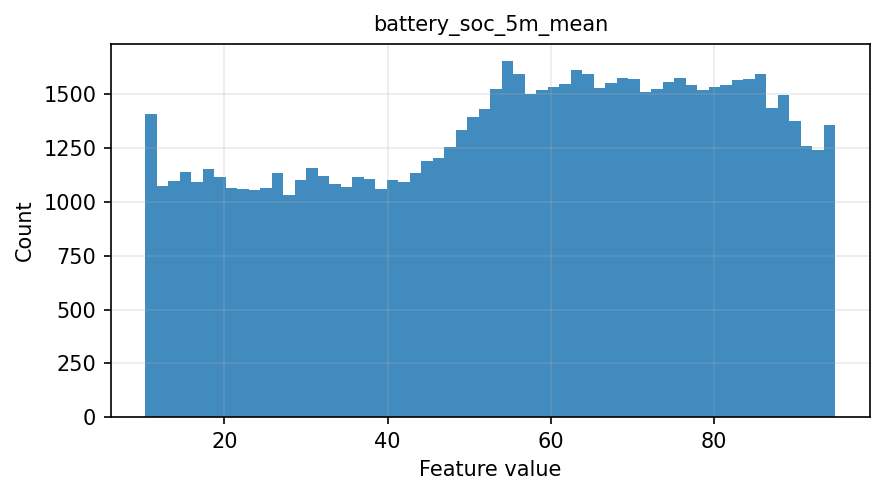

### 2. `battery_soc_5m_slope_pct_per_min`

**Category:** Short-window rolling statistic  
**Rationale:** Estimates short-horizon energy trend and distinguishes active discharge from charging. Useful before low-battery return-to-dock logic.  
**Computation formula:** `(battery_soc_pct[t] - battery_soc_pct[t-300]) / 5 minutes`  
**Expected distribution:** Negative during patrol, positive during charging, near zero during stable idle periods.  
**Known failure modes:** Can be misleading at charging boundary transitions or when SoC telemetry is quantized.  

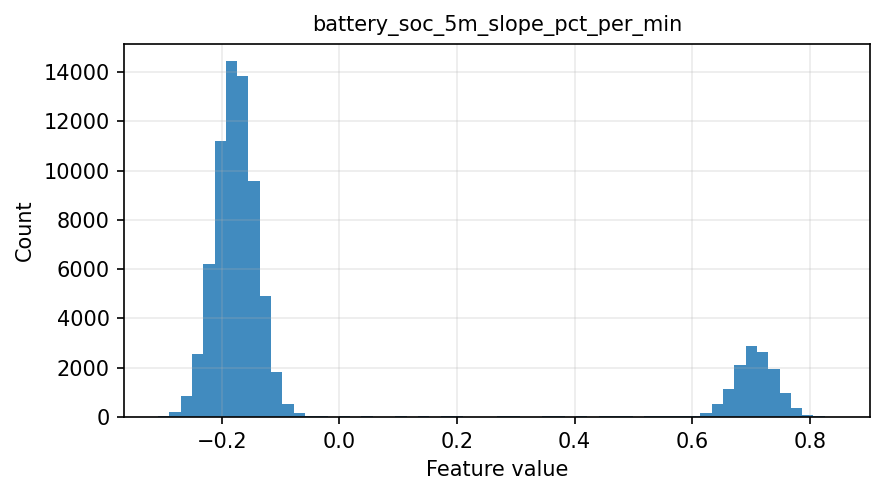

### 3. `battery_voltage_5m_std`

**Category:** Short-window rolling statistic  
**Rationale:** Captures local voltage instability that may appear before power-bus or battery-load anomalies.  
**Computation formula:** `rolling_std(battery_voltage_v, 300 seconds) grouped by robot_id`  
**Expected distribution:** Right-skewed near zero with heavier tail during terrain changes, acceleration, or charging transitions.  
**Known failure modes:** Can rise from benign load changes rather than battery faults; should be interpreted with current and SoC.  

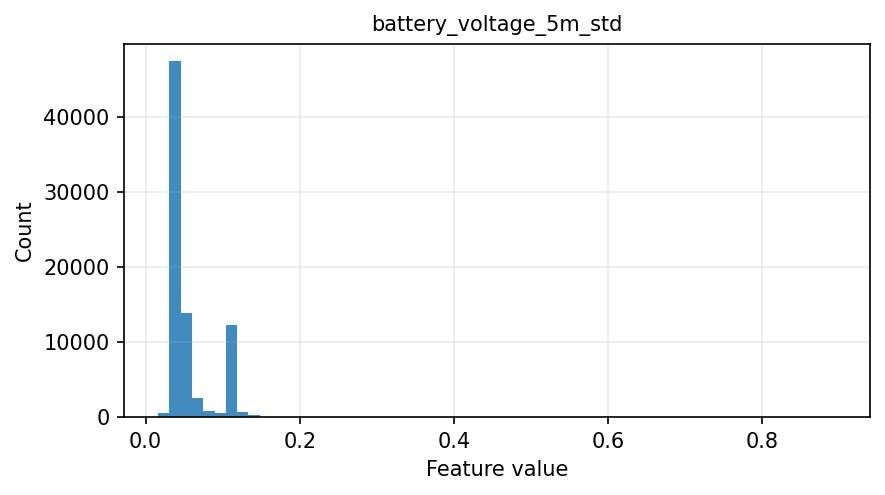

### 4. `battery_voltage_soc_residual`

**Category:** Cross-sensor consistency ratio / residual  
**Rationale:** Compares measured voltage against a simple 48V nominal LiFePO4 SoC-voltage curve to flag sag or charging lift.  
**Computation formula:** `battery_voltage_v - (40.0 + 11.2 * battery_soc_pct / 100)`  
**Expected distribution:** Usually slightly negative during high current draw and positive during charging.  
**Known failure modes:** Simplified chemistry curve ignores temperature, aging, and BMS smoothing.  

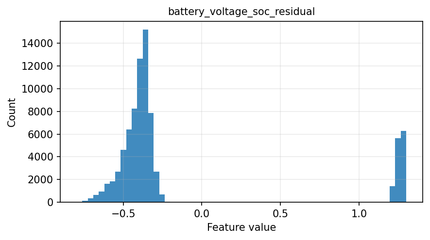

### 5. `discharge_rate_pct_per_min`

**Category:** Short-window rolling statistic  
**Rationale:** Measures energy consumption rate during patrol windows and provides a normalized signal for route difficulty or excessive load.  
**Computation formula:** `-battery_soc_5m_slope_pct_per_min when is_charging = 0`  
**Expected distribution:** Positive during discharge, null during charging, with tail during heavy terrain or high speed.  
**Known failure modes:** Boundary windows around charging can create artifacts; should be masked around dock transitions.  

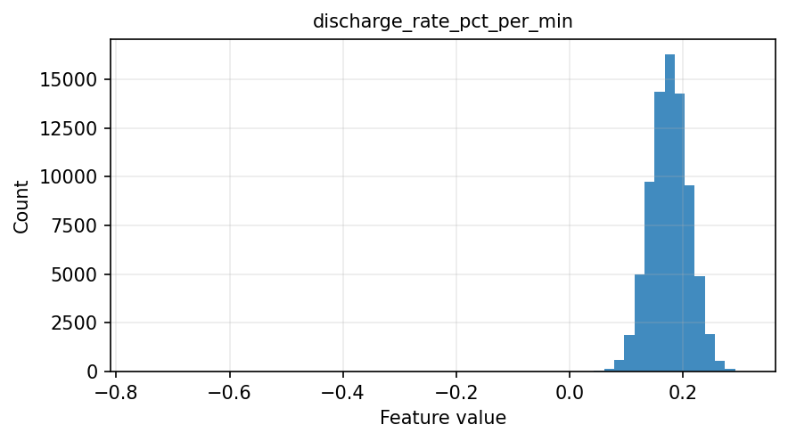

### 6. `motor_current_mean_a`

**Category:** Base aggregate  
**Rationale:** Condenses the four drive-current channels into a propulsion load signal for fleet-level health analysis.  
**Computation formula:** `mean(motor_current_fl_a, motor_current_fr_a, motor_current_rl_a, motor_current_rr_a)`  
**Expected distribution:** Nonnegative, right-skewed; higher under high speed, low-friction terrain, rain, or slope proxy conditions.  
**Known failure modes:** Averages can hide single-motor faults; pair with imbalance ratios.  

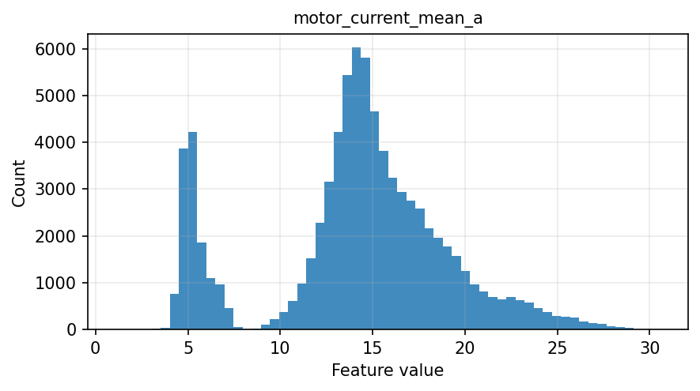

### 7. `motor_current_5m_mean_a`

**Category:** Short-window rolling statistic  
**Rationale:** Smooths transient current spikes and captures sustained load from terrain, thermal drift, or mission mode.  
**Computation formula:** `rolling_mean(motor_current_mean_a, 300 seconds) grouped by robot_id`  
**Expected distribution:** Right-skewed with mode-dependent clusters.  
**Known failure modes:** Short spikes may be smoothed away; lag can delay detection.  

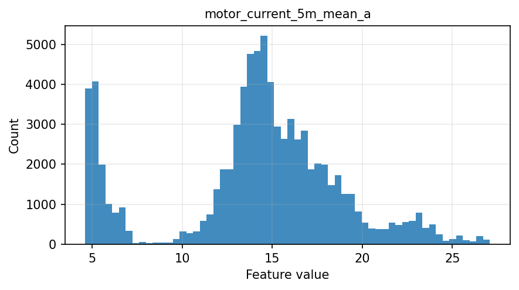

### 8. `motor_current_5m_std_a`

**Category:** Short-window rolling statistic  
**Rationale:** Measures local instability in propulsion demand. Useful for rough terrain, intermittent resistance, or unstable drive behavior.  
**Computation formula:** `rolling_std(motor_current_mean_a, 300 seconds) grouped by robot_id`  
**Expected distribution:** Right-skewed, with near-zero floor during charging or stationary periods.  
**Known failure modes:** Terrain changes can look like instability; should be compared with terrain and speed.  

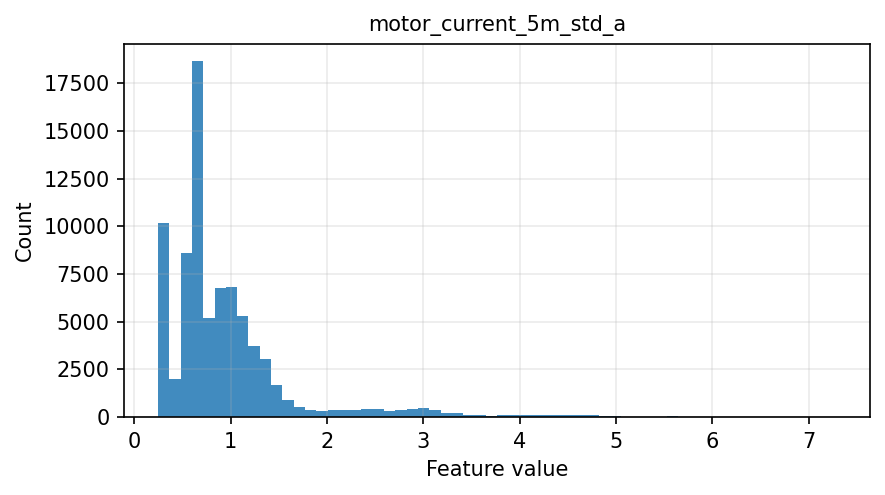

### 9. `motor_side_imbalance_ratio`

**Category:** Cross-sensor consistency ratio  
**Rationale:** Detects left-right drive imbalance that could indicate turning load, wheel drag, drivetrain asymmetry, or motor calibration drift.  
**Computation formula:** `abs(mean(FL, RL) - mean(FR, RR)) / mean(all four motor currents)`  
**Expected distribution:** Usually close to zero, with heavier tail during turns or uneven terrain.  
**Known failure modes:** Expected turning behavior can elevate the ratio without a fault; use with steering angle or gyro_z.  

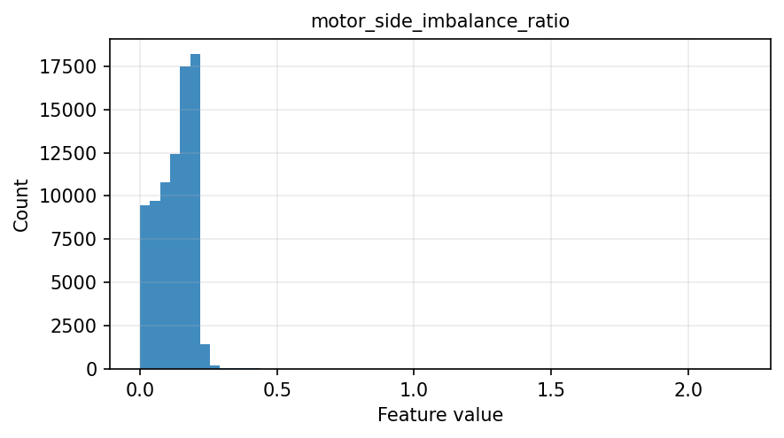

### 10. `motor_front_rear_ratio`

**Category:** Cross-sensor consistency ratio  
**Rationale:** Compares front and rear propulsion load. Helpful for slopes, payload shifts, suspension effects, or axle-level anomalies.  
**Computation formula:** `mean(FL, FR) / (mean(RL, RR) + epsilon)`  
**Expected distribution:** Centered near 1 with moderate spread.  
**Known failure modes:** Can be unstable when all currents are near zero during charging or idle.  

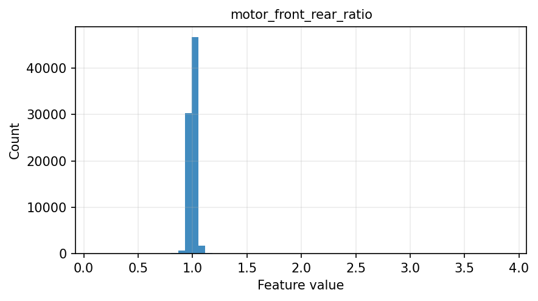

### 11. `motor_temp_current_ratio`

**Category:** Cross-sensor consistency ratio  
**Rationale:** Checks whether motor temperature is plausible relative to current draw. Elevated values can indicate thermal retention or sensor bias.  
**Computation formula:** `motor_temp_c / (motor_current_mean_a + epsilon)`  
**Expected distribution:** Right-skewed; high during low-current hot conditions and lower during active high-current movement.  
**Known failure modes:** Ratio explodes at very low current; should be capped or masked for stationary periods in production.  

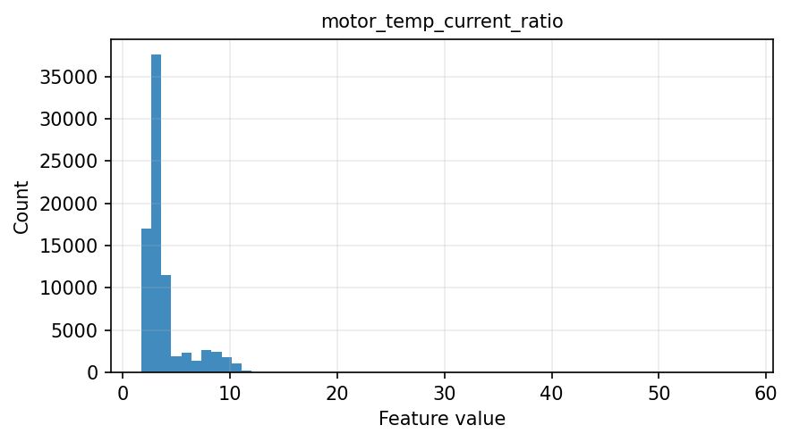

### 12. `imu_accel_norm_mps2`

**Category:** Cross-axis IMU aggregate  
**Rationale:** Combines 3-axis acceleration into a single motion and vibration magnitude signal.  
**Computation formula:** `sqrt(accel_x^2 + accel_y^2 + accel_z^2)`  
**Expected distribution:** Centered near 9.81 m/s² with tails from vibration, acceleration, and benign measurement noise.  
**Known failure modes:** Sensor bias or calibration error can shift the entire distribution.  

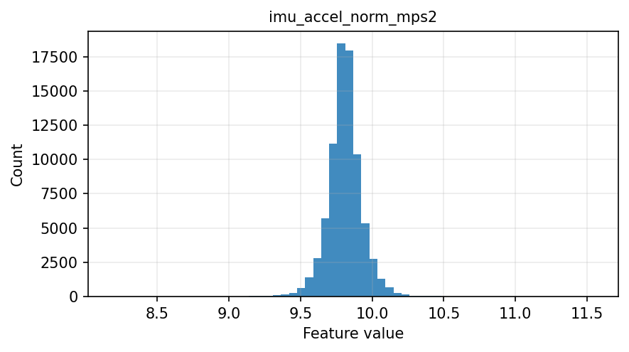

### 13. `imu_gyro_norm_rps`

**Category:** Cross-axis IMU aggregate  
**Rationale:** Combines rotational motion across axes and supports turn, oscillation, and stability monitoring.  
**Computation formula:** `sqrt(gyro_x^2 + gyro_y^2 + gyro_z^2)`  
**Expected distribution:** Near zero during straight or stationary segments, heavier tail during turns and rough ground.  
**Known failure modes:** Gyro bias can cause false persistent rotation signal.  

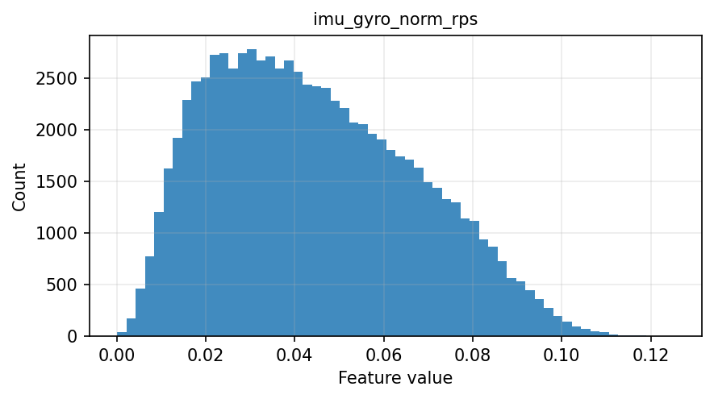

### 14. `imu_vibration_5m_rms`

**Category:** Short-window rolling statistic  
**Rationale:** Measures short-window vibration energy after removing nominal gravity magnitude. Useful for terrain roughness and mechanical stability.  
**Computation formula:** `sqrt(rolling_mean((imu_accel_norm_mps2 - 9.81)^2, 300 seconds))`  
**Expected distribution:** Right-skewed; higher on rough terrain and at higher speed.  
**Known failure modes:** Can rise during benign terrain transitions; requires terrain and speed context.  

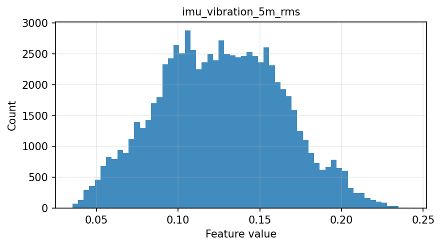

### 15. `accel_gravity_residual_abs`

**Category:** Cross-sensor consistency residual  
**Rationale:** Instantaneous deviation from nominal gravity magnitude, useful for shock, bumps, sensor noise, or high acceleration.  
**Computation formula:** `abs(imu_accel_norm_mps2 - 9.81)`  
**Expected distribution:** Near zero with a heavy right tail.  
**Known failure modes:** Legitimate acceleration and slope can appear as residual deviation.  

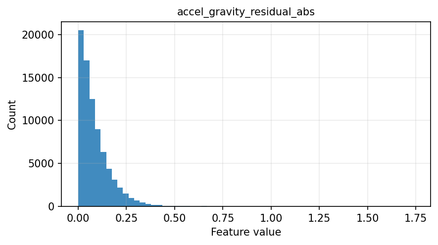

### 16. `speed_current_efficiency`

**Category:** Cross-sensor consistency ratio  
**Rationale:** Compares movement output against electrical drive load. Low values can indicate terrain resistance, wheel slip, or inefficient motion.  
**Computation formula:** `speed_mps / (motor_current_mean_a + epsilon)`  
**Expected distribution:** Positive, right-skewed, with near-zero values during charging or stalled movement.  
**Known failure modes:** Invalid when current is near zero or when robot is intentionally stationary.  

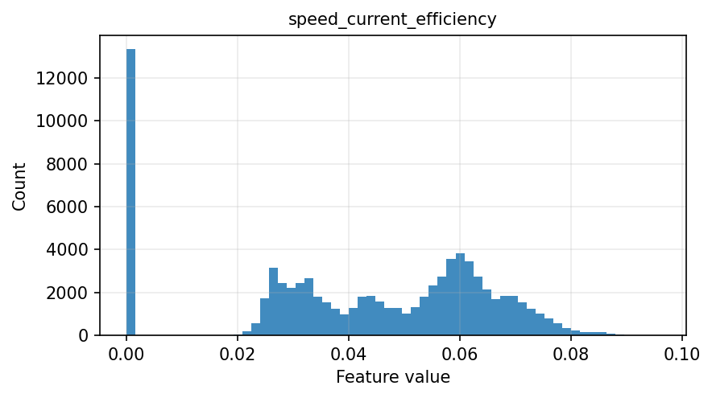

### 17. `wifi_rssi_5m_mean_dbm`

**Category:** Short-window rolling statistic  
**Rationale:** Smooths high-frequency RSSI multipath and shows site-level connectivity zones.  
**Computation formula:** `rolling_mean(wifi_rssi_dbm, 300 seconds) grouped by robot_id`  
**Expected distribution:** Negative dBm values, often multi-modal by location zone.  
**Known failure modes:** Moving through coverage boundaries can blur into an average that hides short outages.  

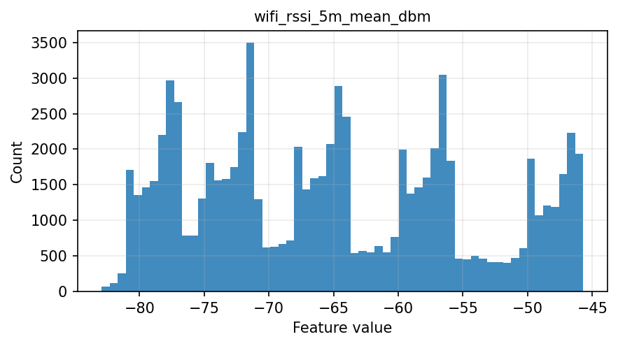

### 18. `wifi_rssi_5m_std_db`

**Category:** Short-window rolling statistic  
**Rationale:** Measures local multipath volatility and short fade risk for outdoor patrol connectivity.  
**Computation formula:** `rolling_std(wifi_rssi_dbm, 300 seconds) grouped by robot_id`  
**Expected distribution:** Right-skewed; higher in building-shadow or remote-edge zones.  
**Known failure modes:** Can be high in benign multipath areas without actual data loss.  

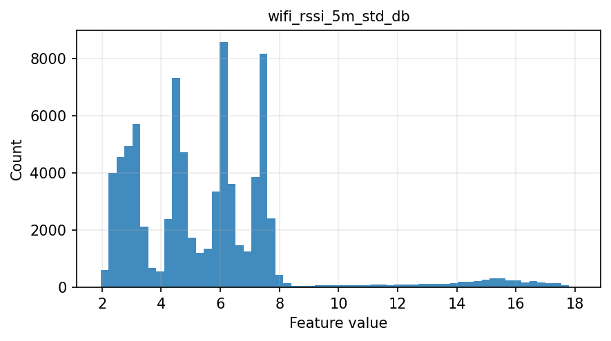

### 19. `gps_hdop_fix_ratio`

**Category:** Cross-sensor consistency ratio  
**Rationale:** Checks whether HDOP and fix quality move consistently. High values indicate weak positioning geometry relative to fix state.  
**Computation formula:** `gps_hdop / (gps_fix_quality + 1)`  
**Expected distribution:** Positive, right-skewed; lower is better.  
**Known failure modes:** HDOP and fix quality are simplified synthetic fields; production GNSS metrics may need richer parsing.  

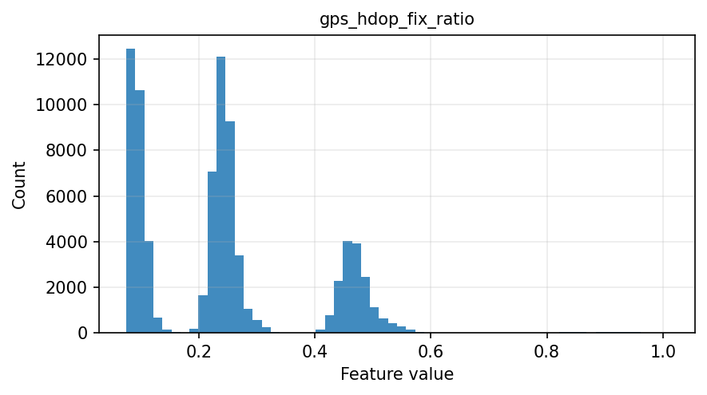

### 20. `gps_wifi_consistency_score`

**Category:** Cross-sensor consistency score  
**Rationale:** Combines location reliability and connectivity strength into one field-readiness proxy.  
**Computation formula:** `0.5 * (gps_fix_quality / 5) + 0.5 * clip((wifi_rssi_dbm + 100) / 65, 0, 1)`  
**Expected distribution:** Bounded 0-1, with lower values in remote or obstructed zones.  
**Known failure modes:** Can mask disagreement if one sensor is strong and the other is weak; inspect components separately.  

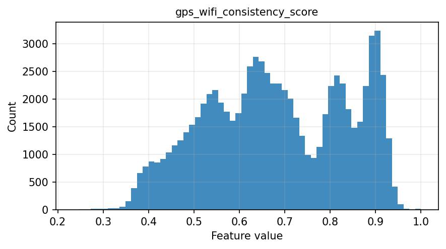

### 21. `battery_soc_interunit_z`

**Category:** Inter-unit z-score  
**Rationale:** Identifies units whose charge state is unusual relative to the fleet at the same timestamp.  
**Computation formula:** `(battery_soc_pct - mean_t(battery_soc_pct across units)) / std_t(across units)`  
**Expected distribution:** Approximately centered near zero across units at each timestamp.  
**Known failure modes:** With only five units, z-scores are sensitive to outliers and may overstate normal phase differences.  

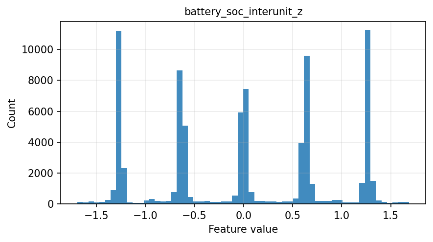

### 22. `motor_current_interunit_z`

**Category:** Inter-unit z-score  
**Rationale:** Flags units drawing unusual current relative to peers at the same second, useful for fleet comparison.  
**Computation formula:** `(motor_current_mean_a - mean_t(motor_current_mean_a across units)) / std_t(across units)`  
**Expected distribution:** Centered around zero, with tails during different mission modes or terrain zones.  
**Known failure modes:** Peer units may be on different terrain or mission modes; compare within route segment when possible.  

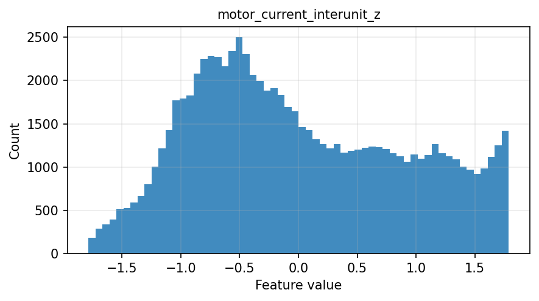

### 23. `wifi_rssi_interunit_z`

**Category:** Inter-unit z-score  
**Rationale:** Highlights units with unusually poor or strong connectivity relative to the fleet at the same time.  
**Computation formula:** `(wifi_rssi_dbm - mean_t(wifi_rssi_dbm across units)) / std_t(across units)`  
**Expected distribution:** Centered around zero; tails reflect location-zone differences.  
**Known failure modes:** If robots are intentionally dispersed, inter-unit RSSI differences may be expected.  

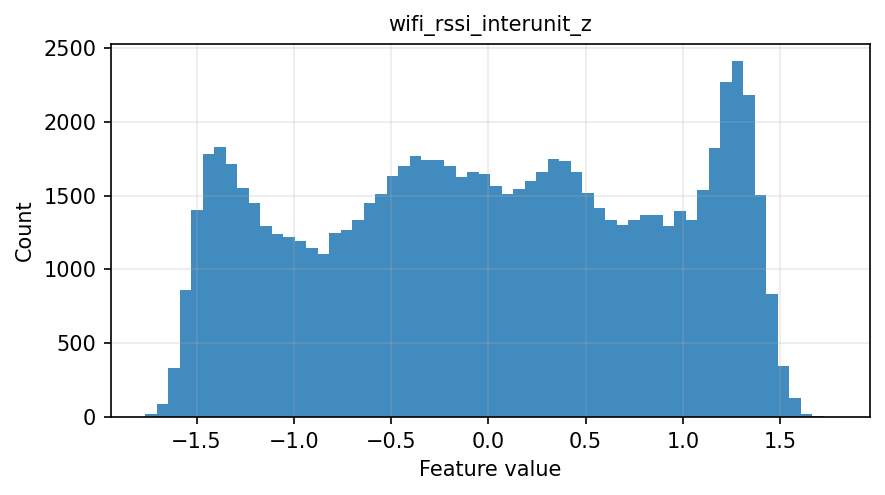

### 24. `task_success_15m_rate`

**Category:** Short-window rolling statistic  
**Rationale:** Turns second-level binary success flags into a short-horizon operational reliability metric.  
**Computation formula:** `rolling_mean(task_success_flag, 900 seconds) grouped by robot_id`  
**Expected distribution:** Bounded 0-1 and usually close to one in normal operation.  
**Known failure modes:** Rare failures make the feature low-variance; it should not be the only anomaly signal.  

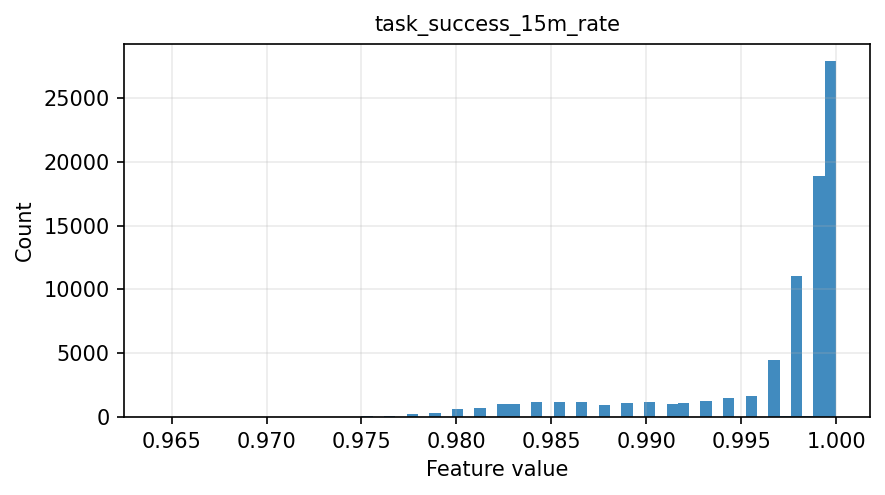

### 25. `missingness_5m_rate`

**Category:** Short-window rolling statistic  
**Rationale:** Measures local data-quality degradation from missing sensor samples.  
**Computation formula:** `rolling_mean(missingness_flag, 300 seconds) grouped by robot_id`  
**Expected distribution:** Near the configured baseline missingness rate, with right tail from clustered missing values.  
**Known failure modes:** The generator includes benign missingness only; real field data may have structured outages.  

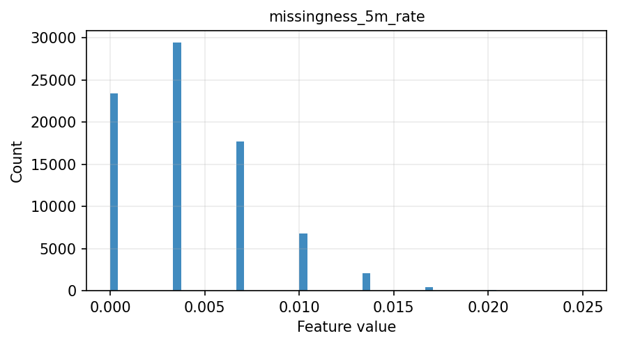

---

## 6. Minimal Reproduction Code

The exact feature code used to create these plots is expected to live in `W03_Telemetry_EDA.ipynb` or a follow-up feature-engineering notebook. The outline is:

```python
import glob
import numpy as np
import pandas as pd

files = glob.glob('data/w03_rover_5units_1day/**/telemetry.csv.gz', recursive=True)
df = pd.concat([pd.read_csv(f) for f in files], ignore_index=True)
df['timestamp'] = pd.to_datetime(df['timestamp'], utc=True)
df = df.sort_values(['robot_id', 'timestamp'])

motor_cols = ['motor_current_fl_a', 'motor_current_fr_a', 'motor_current_rl_a', 'motor_current_rr_a']
motor_mean = df[motor_cols].mean(axis=1)
battery_soc_5m_mean = df.groupby('robot_id')['battery_soc_pct'].transform(lambda x: x.rolling(300, min_periods=30).mean())
motor_current_interunit_z = (motor_mean - motor_mean.groupby(df['timestamp']).transform('mean')) / motor_mean.groupby(df['timestamp']).transform('std')
```