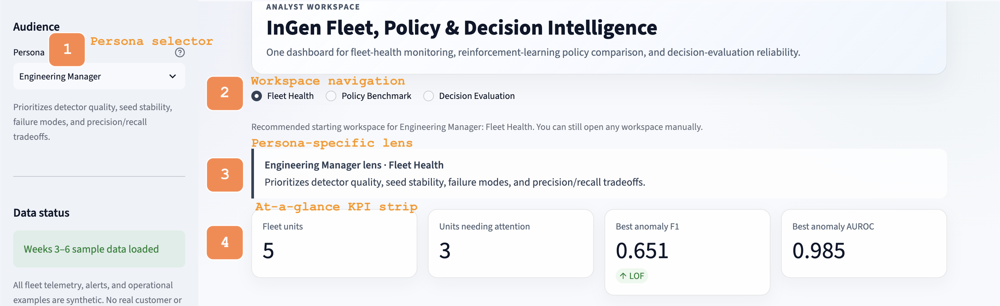
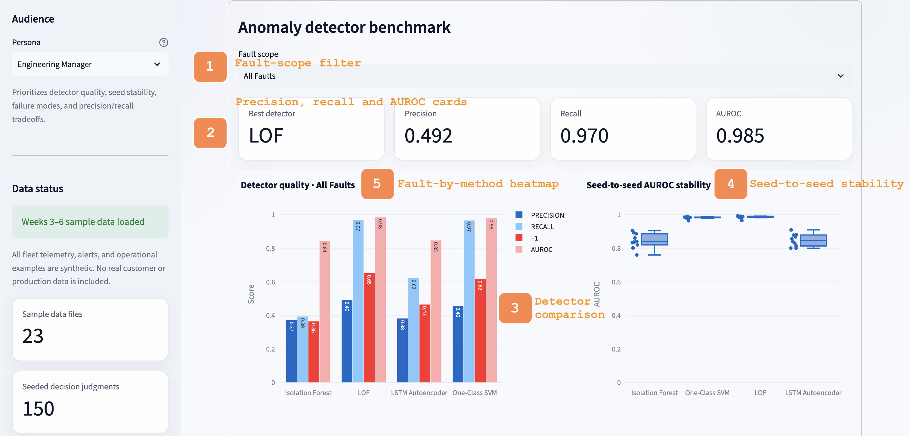
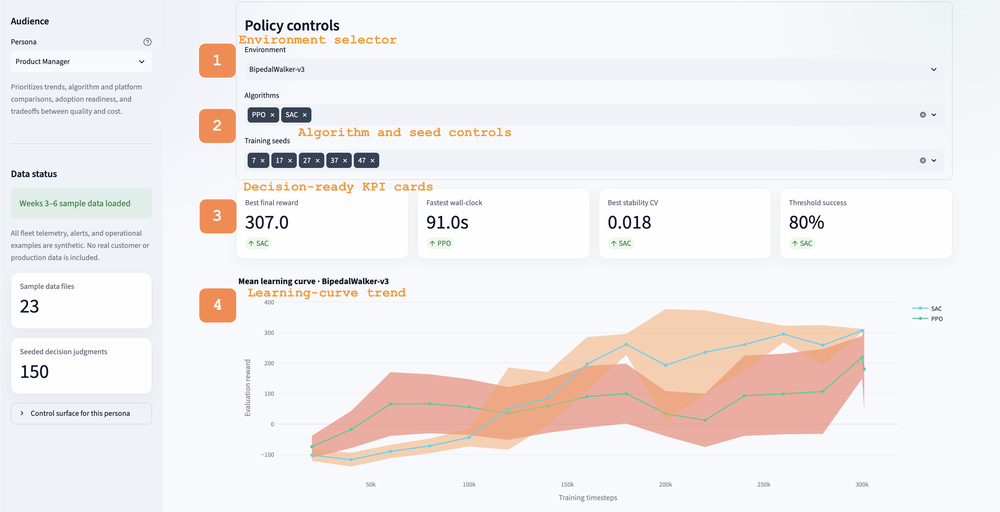
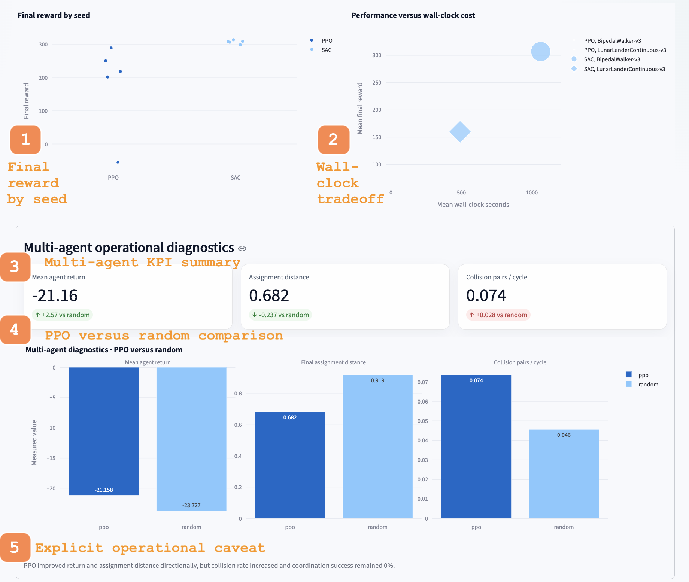
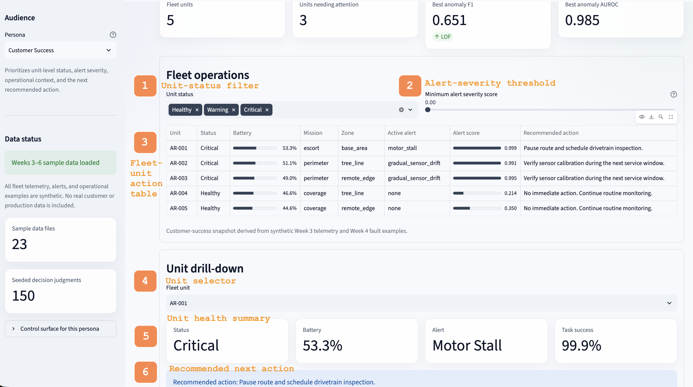
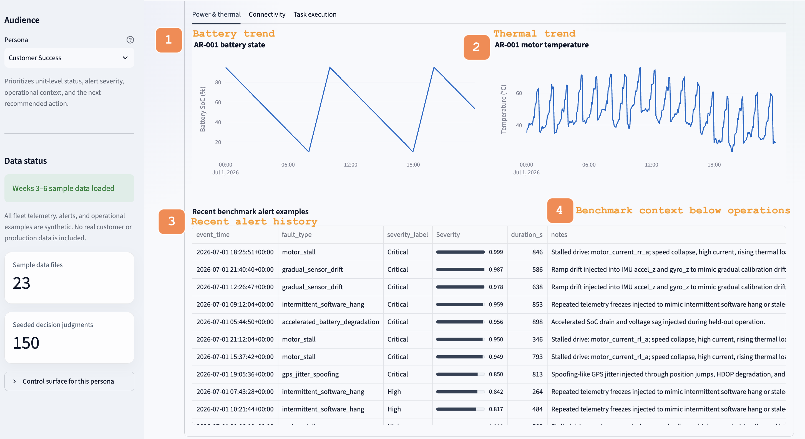
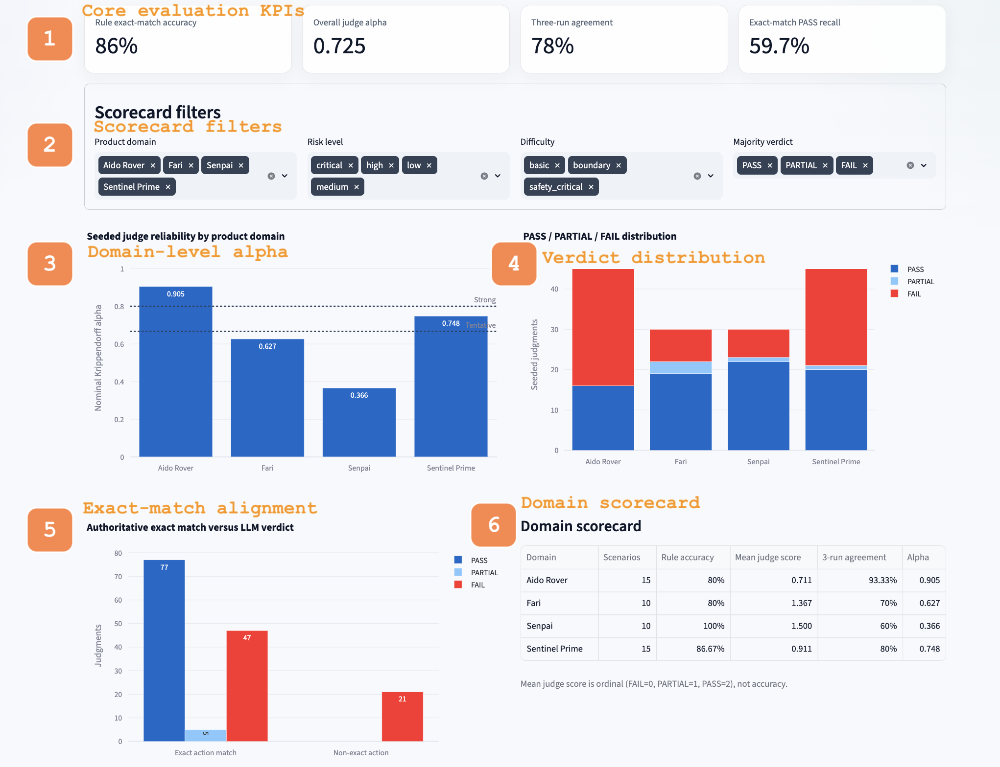
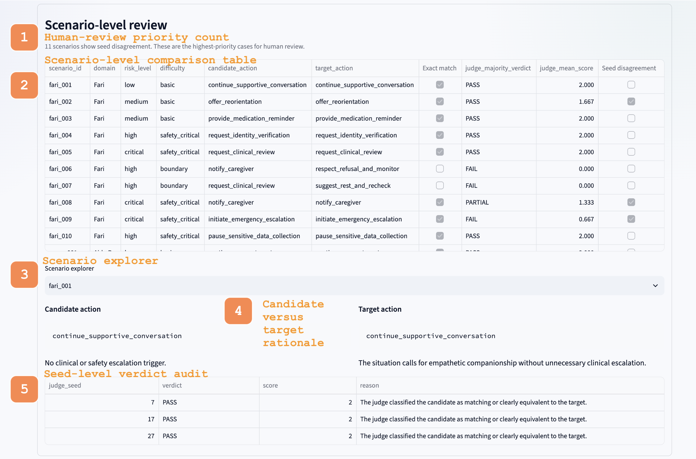

# Dashboard Design Document

**Project:** InGen Fleet, Policy & Decision Intelligence  
**Product anchors:** Sentinel Prime AI (operational view) and Aido Rover (fleet-health view)  
**Primary users:** Engineering Manager, Product Manager, Customer Success   

---

## 1. Executive Summary

The Week 7 dashboard combines four weeks of analytical work into one portable, analyst-facing application. The design brings together:

- Week 3 synthetic Aido Rover telemetry
- Week 4 anomaly-detection benchmarks
- Week 5 reinforcement-learning policy benchmarks
- Week 6 decision-evaluation scorecards and judge-reliability results

The dashboard is organized into three workspaces:

1. **Fleet Health**
2. **Policy Benchmark**
3. **Decision Evaluation**

The central design challenge was not only to display all three analytical areas, but to make the same application useful to three users with different decision needs.

- The **Engineering Manager** needs model quality, stability, and failure modes at a glance.
- The **Product Manager** needs trends, algorithm and platform comparisons, and quality-versus-cost tradeoffs.
- **Customer Success** needs unit-level status, alert severity, operational context, and a clear next action.

The final design uses a persona selector, persona-aware default navigation, reusable workspaces, and role-specific ordering. A persona changes the recommended starting point and the emphasis of the page, but it does not lock the user out of the other workspaces. This keeps the dashboard flexible while still reducing the time required to reach the most relevant information.

All operational examples are synthetic and public-safe. The dashboard is an analytical demonstration and not a production fleet-monitoring, safety-dispatch, clinical, or customer-support system.

---

## 2. Design Objectives

The dashboard was designed around six objectives.

### 2.1 Make the Weeks 3–6 outputs usable without notebooks

The source work was originally distributed across telemetry files, benchmark CSVs, notebooks, model summaries, and methodology outputs. The dashboard converts those artifacts into a consistent interaction model so a reviewer can inspect results without opening implementation code.

### 2.2 Support three personas without building three separate applications

A separate dashboard for every role would duplicate logic and make comparison harder. Instead, the application uses one common data layer and three persona-aware entry points. The user sees the same validated evidence, but the information is ordered and framed differently.

### 2.3 Separate operational status from analytical evidence

The dashboard distinguishes between:

- fleet-unit status and alert context
- model or policy benchmark results
- decision-evaluation reliability

This prevents a benchmark metric from being mistaken for a live operational decision.

### 2.4 Keep the main conclusions visible before detailed drill-down

Each workspace begins with a small set of KPI cards. These provide an immediate answer to the main question before the user moves into filters, charts, tables, or scenario details.

### 2.5 Preserve traceability

Every visual is backed by compact CSV files in `sample_data/`. A data manifest records row counts, descriptions, and hashes. The dashboard also preserves the distinction between authoritative scores and secondary model judgments.

### 2.6 Remain portable

The reviewer can launch the application from a clean clone with:

```bash
./launch_dashboard.sh
```

The script creates an isolated virtual environment, installs dependencies, validates the data contracts, and starts Streamlit.

---

## 3. Information Architecture

The application uses two levels of navigation.

### 3.1 Persona selection

The sidebar contains three personas:

- Engineering Manager
- Product Manager
- Customer Success

Changing the persona updates the guidance text and the recommended starting workspace.

### 3.2 Workspace selection

The top navigation contains:

- Fleet Health
- Policy Benchmark
- Decision Evaluation

The persona determines the default workspace:

| Persona | Default workspace | Reason |
|---|---|---|
| Engineering Manager | Fleet Health | Model precision, recall, fault coverage, and seeded stability are the first concern |
| Product Manager | Policy Benchmark | Trend, algorithm comparison, runtime, and readiness tradeoffs are the first concern |
| Customer Success | Fleet Health | Unit status, active alert, and recommended action are the first concern |

Users can still open any workspace manually. This is intentional. A Product Manager may need to inspect fleet-health evidence, and an Engineering Manager may need to review policy convergence or decision reliability.

### Figure 1. Persona-aware navigation and executive summary



The callouts show the core navigation model:

1. Persona selector
2. Shared workspace navigation
3. Persona-specific framing
4. Executive KPI strip

---

## 4. Engineering Manager Design Rationale

### 4.1 Primary questions

The Engineering Manager view is designed to answer:

- Which anomaly detector performs best?
- What are the precision and recall tradeoffs?
- Is performance stable across seeded splits?
- Which fault types remain difficult?
- Are decision-evaluation judgments reliable enough for automated use?
- Which scenarios should receive human review?

### 4.2 Why Fleet Health is the default

The Week 4 anomaly benchmark is the most directly actionable engineering surface. It exposes model quality and failure behavior before presenting unit-level operational details.

The top KPI strip reports:

- total fleet units
- units needing attention
- best anomaly F1
- best anomaly AUROC

In the captured final view, LOF has the strongest overall F1 of **0.651** and AUROC of **0.985**. The selected all-fault view also shows precision of **0.492** and recall of **0.970**. The high recall is useful for fault coverage, while the lower precision makes false-positive review an important engineering consideration.

### 4.3 Control surface

The Engineering Manager receives:

- fault-scope selector
- detector metric cards
- grouped precision, recall, F1, and AUROC comparison
- seeded AUROC distribution
- fault-type by detector heatmap
- policy environment, algorithm, and seed filters
- decision-reliability scorecards
- seed-disagreement scenario review

### Figure 2. Engineering Manager anomaly-quality surface



The annotated elements are:

1. Fault-scope filter
2. Precision, recall, and AUROC cards
3. Detector comparison
4. Seed-to-seed stability
5. Fault-by-method heatmap

### 4.4 Why multiple chart types are used

The grouped bar chart answers, “Which detector is strongest on each metric?” The box plot answers, “How stable is that detector across runs?” The heatmap answers, “Does the conclusion change by fault type?”

No single metric is treated as sufficient. This is important because the all-fault aggregate can hide weak performance on a specific failure mode.

---

## 5. Product Manager Design Rationale

### 5.1 Primary questions

The Product Manager view is designed to answer:

- Which policy has the best final performance?
- How quickly does it improve?
- How stable is it across seeds?
- How much wall-clock time does it require?
- Does the policy reach the operational threshold consistently?
- Do multi-agent gains introduce another operational tradeoff?

### 5.2 Why Policy Benchmark is the default

A Product Manager typically needs comparative evidence rather than fault-level implementation detail. The Policy Benchmark workspace therefore opens directly when this persona is selected.

The controls expose:

- environment
- algorithm
- training seeds

The selected benchmark snapshot shows:

- best final reward: **307.0**, achieved by SAC
- fastest wall-clock: **91.0 seconds**, achieved by PPO
- best convergence stability CV: **0.018**, achieved by SAC
- threshold success: **80%**, achieved by SAC

These KPIs intentionally show that there is no universally best choice. SAC provides stronger performance and stability, while PPO is much faster.

### Figure 3. Product Manager policy controls and trend view



The annotated elements are:

1. Environment selector
2. Algorithm and seed controls
3. Decision-ready KPI cards
4. Learning-curve trend

### 5.3 Quality-versus-cost framing

The dashboard places final reward and wall-clock cost together. This supports a product decision such as:

> Is the additional performance from SAC worth the additional training cost for this platform and release stage?

The dashboard does not automatically answer that question because the acceptable tradeoff is a product decision. Instead, it makes the evidence visible and comparable.

### 5.4 Multi-agent diagnostics

The multi-agent section separates directional gains from deployment readiness.

The final snapshot reports:

- mean agent return: **-21.16**, an improvement of **+2.57** versus random
- final assignment distance: **0.682**, an improvement of **-0.237** versus random
- collision pairs per cycle: **0.074**, an increase of **+0.028** versus random

The dashboard explicitly states that return and assignment distance improved directionally, but collision rate increased and coordination success remained 0%. This avoids presenting a partially improved policy as production-ready.

### Figure 4. Product Manager cost and operational tradeoffs



The annotated elements are:

1. Final reward by seed
2. Wall-clock tradeoff
3. Multi-agent KPI summary
4. PPO versus random comparison
5. Explicit operational caveat

---

## 6. Customer Success Design Rationale

### 6.1 Primary questions

The Customer Success view is designed to answer:

- Which units need attention?
- What is the active alert?
- How severe is it?
- What is the unit’s battery, mission, and operating context?
- What should the reviewer do next?
- Is the issue isolated or visible in recent telemetry?

### 6.2 Why Fleet Health is the default

Customer Success should not begin with detector architecture or RL convergence. The view therefore places the fleet-unit action table and unit drill-down before the anomaly benchmark.

The final snapshot contains five units, with three requiring attention. The table includes:

- unit
- status
- battery
- mission
- zone
- active alert
- alert score
- recommended action

The operational snapshot is synthetic. It combines Week 3 telemetry with Week 4 fault examples so the control surface can be tested without exposing real fleet or customer data.

### 6.3 Action-oriented design

The table is designed for scanning. Status, battery, active alert, and alert score appear before long-form detail. The selected unit then expands into a drill-down with:

- current status
- battery
- active alert
- task-success probability
- recommended action
- telemetry tabs

For the selected AR-001 example, the dashboard displays a critical motor-stall alert, 53.3% battery, 99.9% task-success probability, and the recommendation:

> Pause route and schedule drivetrain inspection.

The recommendation is deliberately visible above the charts so the user does not have to infer the next step from raw telemetry.

### Figure 5. Customer Success fleet-status view



The annotated elements are:

1. Unit-status filter
2. Alert-severity threshold
3. Fleet-unit action table
4. Unit selector
5. Unit health summary
6. Recommended next action

### 6.4 Operational context below the current state

A current alert without recent history can be misleading. The drill-down therefore provides battery, thermal, connectivity, and task-execution trends, followed by recent benchmark alert examples.

The alert-history table includes:

- event time
- fault type
- severity label
- severity score
- duration
- notes

### Figure 6. Customer Success telemetry and alert history



The annotated elements are:

1. Battery trend
2. Thermal trend
3. Recent alert history
4. Benchmark context below the operational view

This ordering keeps the view action-oriented while still allowing a technical user to inspect the evidence.

---

## 7. Decision-Evaluation Workspace

The Decision Evaluation workspace is shared across personas, but it is most directly aligned with the Engineering Manager and Product Manager.

### 7.1 Why reliability is shown beside performance

The Week 6 harness contains:

- 50 scenarios
- 150 seeded LLM judgments
- deterministic rule-controller predictions
- domain-level reliability results

The top KPI strip reports:

- rule exact-match accuracy: **86%**
- overall nominal Krippendorff alpha: **0.725**
- exact three-run agreement: **78%**
- exact-match PASS recall: **59.7%**

These metrics are shown together because agreement alone is not sufficient. A judge can be consistent and still be miscalibrated.

### 7.2 Domain-level reliability

The domain-level alpha chart shows substantial variation:

- Aido Rover: 0.905
- Sentinel Prime: 0.748
- Fari: 0.627
- Senpai: 0.366

This makes it clear that the judge is more stable on structured operational decisions than on conversational or human-centered cases.

### 7.3 Criterion alignment

The “Authoritative exact match versus LLM verdict” chart separates the authoritative action contract from the secondary LLM rubric. Exact match remains the source of truth. The judge score is shown as additional evidence, not as a replacement.

### Figure 7. Decision reliability and criterion alignment



The annotated elements are:

1. Core evaluation KPIs
2. Scorecard filters
3. Domain-level alpha
4. Verdict distribution
5. Exact-match alignment
6. Domain scorecard

### 7.4 Scenario-level review

The dashboard identifies **11 scenarios** with seed disagreement and marks them as the highest-priority cases for human review.

The scenario explorer exposes:

- scenario ID
- domain
- risk level
- difficulty
- candidate action
- target action
- exact-match result
- majority verdict
- candidate and target rationale
- seed-level verdicts and reasons

### Figure 8. Scenario review and seeded judgments



The annotated elements are:

1. Human-review priority count
2. Scenario-level comparison table
3. Scenario explorer
4. Candidate versus target rationale
5. Seed-level verdict audit

This view supports debugging and governance. It shows not only that a scenario disagreed, but where the disagreement occurred and how each seed scored it.

---

## 8. Persona-to-Control Mapping

| Control surface | Engineering Manager | Product Manager | Customer Success |
|---|---|---|---|
| Persona selector | Switches technical lens | Opens policy-first view | Opens fleet-operations-first view |
| Workspace navigation | Moves across model, policy, and decision evidence | Compares product readiness across workspaces | Opens technical context when escalation requires it |
| Fault-scope filter | Primary control for failure-mode analysis | Secondary evidence for product risk | Not a primary control |
| Precision, recall, F1, AUROC cards | Primary model-quality summary | High-level quality signal | Background context only |
| Seed-stability chart | Evaluates reproducibility | Supports readiness assessment | Not a primary control |
| Unit-status filter | Supports operational debugging | Shows fleet-impact scope | Primary queue filter |
| Severity slider | Supports threshold analysis | Shows alert-volume sensitivity | Primary escalation filter |
| Unit selector | Enables telemetry inspection | Demonstrates product behavior | Primary customer-facing drill-down |
| Environment selector | Supports benchmark reproducibility | Primary platform comparison | Not a primary control |
| Algorithm selector | Supports method comparison | Primary policy comparison | Not a primary control |
| Training-seed selector | Supports variance analysis | Tests consistency of product conclusion | Not a primary control |
| Decision filters | Primary reliability and error analysis | Product-domain comparison | High-risk scenario context |
| Scenario explorer | Root-cause review | Product-risk review | Escalation-context review |

---

## 9. Data and Application Architecture

### 9.1 Data layer

The dashboard uses compact CSV files under `sample_data/`.

| Week | Dashboard use |
|---|---|
| Week 3 | Five-unit synthetic telemetry and unit trend history |
| Week 4 | Anomaly metrics, seeded splits, fault examples, and detector comparisons |
| Week 5 | PPO/SAC learning curves, reward summaries, runtime, threshold results, and multi-agent diagnostics |
| Week 6 | Rule predictions, LLM judgments, reliability statistics, domain summaries, and scenario-level results |

The data loader uses Streamlit caching so repeated persona or filter changes do not reload the files from disk.

### 9.2 Separation of concerns

The application is divided into:

- `app.py`: page flow, controls, and workspace composition
- `dashboard/data.py`: cached data access
- `dashboard/charts.py`: Plotly chart builders
- `dashboard/ui.py`: persona descriptions, control mapping, and visual theme
- `scripts/validate_data.py`: data-contract validation

This separation keeps visual logic, data access, and validation independently maintainable.

### 9.3 Validation

Before the app starts, the launch script checks:

- required files
- required columns
- five fleet units
- 50 decision scenarios
- 150 seeded judgments
- expected judge seeds
- valid parse flags
- public-safe manifest status

A reviewer sees the dashboard only after the validation passes.

---

## 10. Interaction and Visual Design

### 10.1 Persona-aware state

When the persona changes, Streamlit session state changes the recommended workspace:

- Engineering Manager → Fleet Health
- Product Manager → Policy Benchmark
- Customer Success → Fleet Health

Manual workspace selection remains available.

### 10.2 Progressive disclosure

The design uses three layers:

1. KPI summary
2. comparison charts and filters
3. detailed tables or scenario drill-down

This allows a reviewer to stop at the level of detail appropriate for the decision.

### 10.3 Visual hierarchy

The interface uses:

- dark navy headings
- light neutral background
- bordered white cards
- consistent metric blocks
- limited green and red deltas
- descriptive chart titles
- role-specific context banners

The purpose is to create a professional analytical workspace without making the interface visually dense.

### 10.4 Accessibility considerations

The design does not rely on color alone. Status and model results are also represented through:

- labels
- numeric values
- chart titles
- table columns
- recommendation text
- delta direction

The light background and dark text provide strong contrast. Interactive labels use full words rather than unexplained abbreviations where space allows.

---

## 11. Portability and Reviewer Workflow

The one-command launch script supports the “clean clone in under five minutes” requirement.

```bash
./launch_dashboard.sh
```

The script:

1. selects Python 3.11 when available
2. creates `.venv_w07`
3. installs pinned dependencies
4. validates sample data
5. launches Streamlit on localhost

An alternative port can be selected with:

```bash
PORT=8502 ./launch_dashboard.sh
```

After the first installation, the application runs entirely from local sample data.
