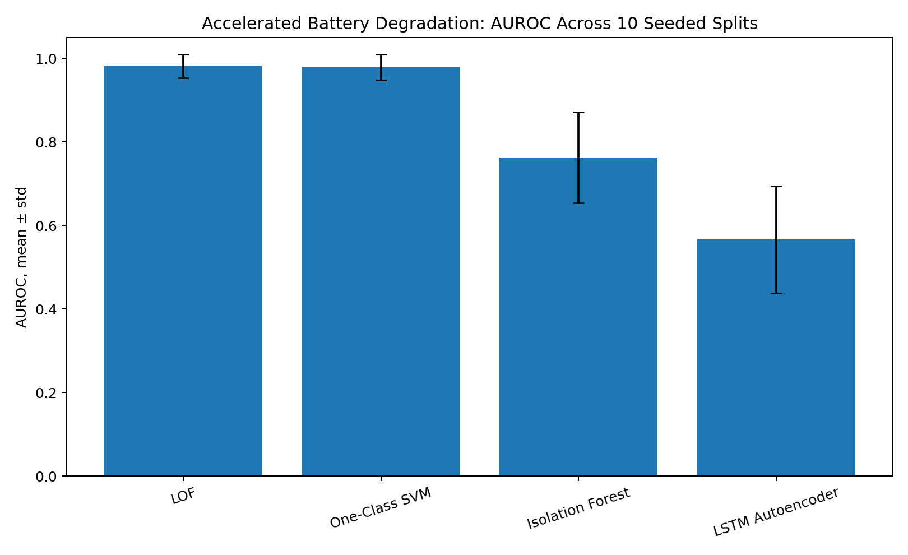
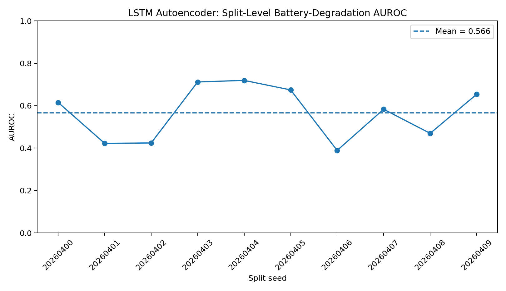
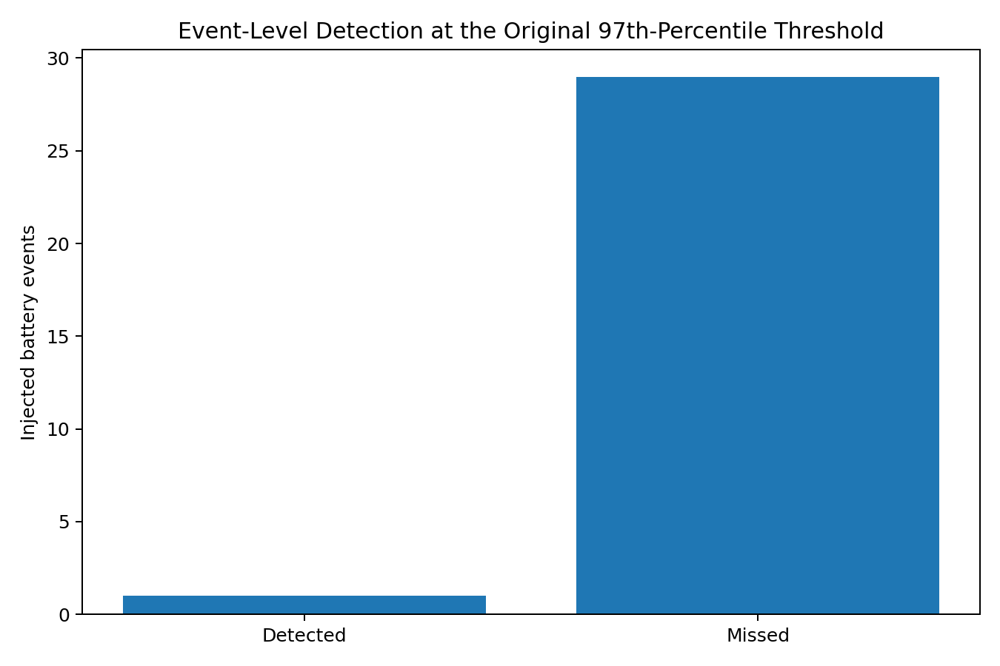
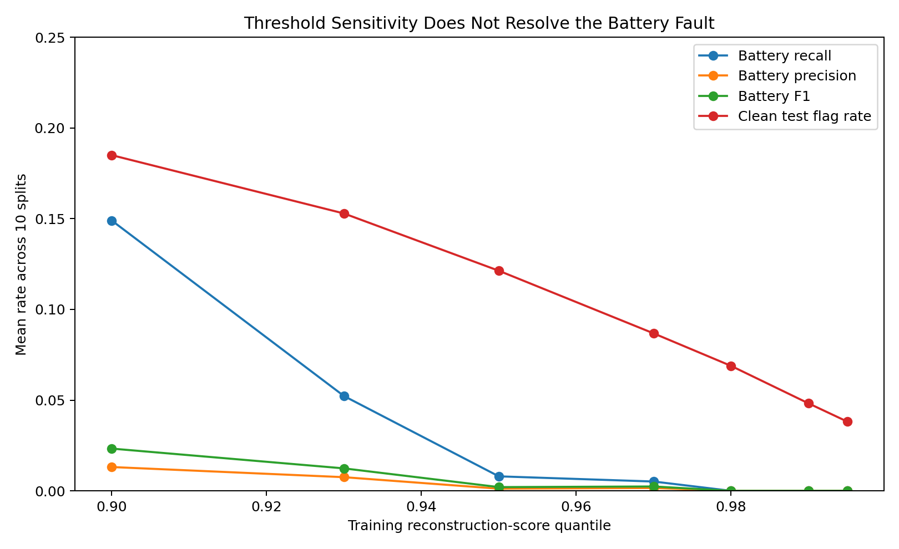
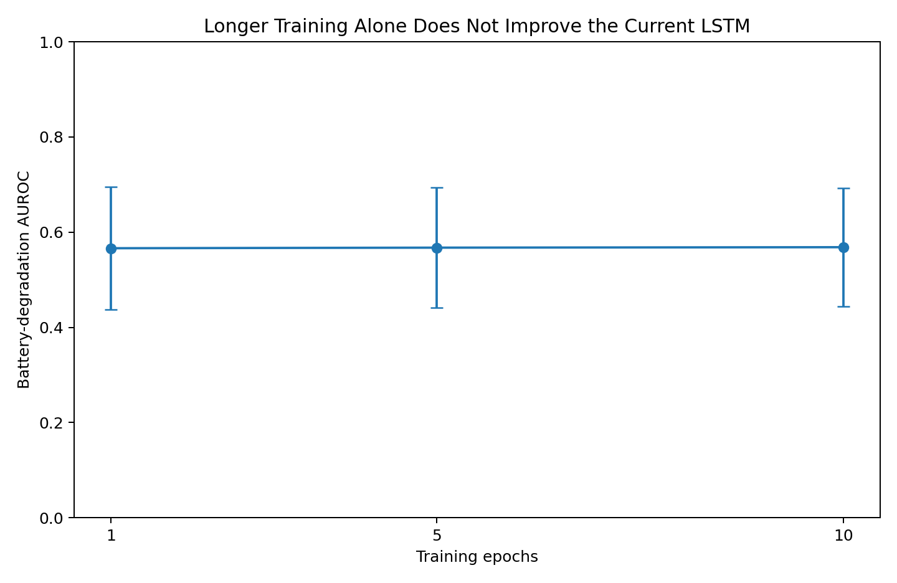
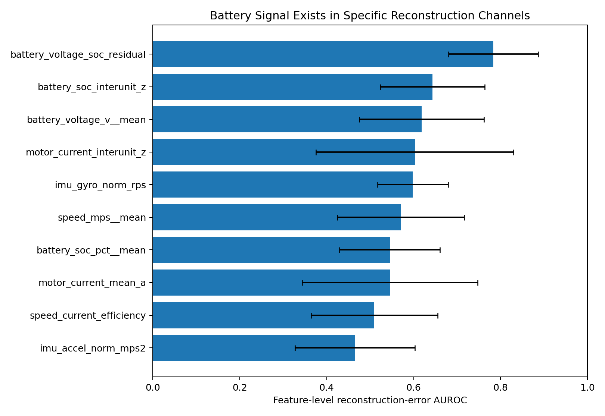

# LSTM Autoencoder Follow-Up: Accelerated Battery Degradation

**Week 8 Capstone Supporting Analysis**  
**Author:** Xirui (Crissy) Chen, Applied AI Analyst Intern  
**Supervisor follow-up:** “Please analyze the LSTM Autoencoder's performance on the `accelerated_battery_degradation` fault before finalizing the capstone.”

## Executive Conclusion

The configured Week 4 LSTM Autoencoder should **not** be promoted as a detector for accelerated battery degradation.

Across the same 10 seeded splits used in the final Week 4 benchmark, its battery-degradation AUROC was **0.566 ± 0.128**, with precision **0.0016 ± 0.0049**, recall **0.0051 ± 0.0162**, and F1 **0.0024 ± 0.0076**. Nine of the ten splits had zero recall. At the event level, the original 97th-percentile operating threshold detected at least one anomalous window in only **1 of 30** injected accelerated-battery-degradation events.

This is materially weaker than the classical detectors. LOF reached **0.982 ± 0.028 AUROC**, and One-Class SVM reached **0.979 ± 0.031**. The paired Week 4 Wilcoxon tests show that the LSTM gap is consistent across the matched split seeds.

The follow-up diagnostics also show that the result is **not mainly a threshold-calibration problem or a one-epoch-training problem**. Lowering the threshold increases clean-window flagging much faster than it improves useful battery detection, and increasing training from 1 to 5 or 10 epochs leaves the AUROC essentially unchanged.

The most useful diagnostic is the reconstruction-score decomposition. Battery-specific reconstruction channels contain noticeably more signal than the current global score. For example, reconstruction error on `battery_voltage_soc_residual` alone reaches **0.783 ± 0.103 AUROC**. A post-hoc score that averages only four battery-related reconstruction channels improves the mean AUROC from **0.566** to **0.670 ± 0.093**. That is still well below LOF and One-Class SVM, but it indicates that the current equal-weight MSE across 17 features dilutes a localized battery signal.

**Capstone implication:** keep **LOF as the primary accuracy-maximizing anomaly detector**. Do not describe the current LSTM Autoencoder as a specialized battery detector. If sequence modeling is revisited, the next experiment should use battery-weighted reconstruction scoring, longer-horizon battery-health features, and a larger clean training history rather than simply increasing the epoch count.

---

## 1. Question and Scope

The Week 4 benchmark found that the LSTM Autoencoder performed well on several injected faults but poorly on `accelerated_battery_degradation`. Because battery degradation is temporal by nature, this was the one LSTM result that most clearly deserved additional review before the final capstone recommendation.

This follow-up asks four questions:

1. How weak is the LSTM result, and is the weakness stable across split seeds?
2. Is the operating threshold simply too conservative?
3. Is one training epoch the main reason for the poor result?
4. Does the trained LSTM contain battery-specific reconstruction signal that is being lost when all feature errors are averaged into one anomaly score?

The analysis uses the final Week 4 benchmark outputs and the Week 3 five-unit, one-day synthetic Rover telemetry sample. The original split seeds, held-out-hour design, one-minute windows, train-only scaling, LSTM architecture, and threshold rule are retained.

---

## 2. Original Evaluation Setup

The relevant Week 4 configuration was:

| Item | Setting |
|---|---|
| Clean telemetry | 5 Aido Rover units, 1 day, 1 Hz |
| Evaluation level | 60-second windows |
| Seeded train/test splits | 10 |
| Held-out test hours per split | 8 |
| Battery events per split | 3 |
| Total battery events | 30 |
| LSTM sequence length | 8 windows, or 8 minutes |
| LSTM hidden dimension | 16 |
| LSTM latent dimension | 8 |
| Training epochs | 1 |
| Batch size | 256 |
| Maximum clean training sequences | 1,000 |
| Operating threshold | 97th percentile of clean training reconstruction scores |
| LSTM input features | 17 |
| Primary LSTM anomaly score | Mean reconstruction MSE across all time steps and all 17 features |

The synthetic battery fault accelerates SoC decline and adds voltage sag during held-out operation. Battery-event duration averaged **618.5 seconds**, with a range from **275 to 898 seconds**. **10 of 30** events were shorter than the eight-minute LSTM sequence length.

The LSTM inputs include battery SoC, battery voltage, a voltage-versus-SoC residual, and an inter-unit battery SoC z-score. The injection also changes `task_success_probability`, but that field is not part of the LSTM input. This omission is worth noting, although it does not explain the method gap by itself because the classical benchmark features also do not use that probability field.

---

## 3. Main Performance Result

### 3.1 Cross-method comparison

| Method | Precision | Recall | F1 | AUROC |
|---|---:|---:|---:|---:|
| LOF | 0.169 ± 0.046 | 0.949 ± 0.153 | 0.285 ± 0.070 | **0.982 ± 0.028** |
| One-Class SVM | 0.155 ± 0.050 | 0.963 ± 0.108 | 0.265 ± 0.076 | **0.979 ± 0.031** |
| Isolation Forest | 0.031 ± 0.030 | 0.110 ± 0.135 | 0.046 ± 0.047 | 0.763 ± 0.109 |
| LSTM Autoencoder | **0.0016 ± 0.0049** | **0.0051 ± 0.0162** | **0.0024 ± 0.0076** | **0.566 ± 0.128** |



The LSTM is clearly the weakest method for this fault. In the paired Wilcoxon tests across the same 10 seeds:

- LOF exceeds the LSTM by about **0.415 AUROC**, two-sided **p = 0.001953**
- One-Class SVM exceeds the LSTM by about **0.413**, **p = 0.001953**
- Isolation Forest exceeds the LSTM by about **0.197**, **p = 0.001953**

The LSTM's battery result is also its weakest per-fault AUROC in the Week 4 benchmark. The same model reaches much stronger AUROC on motor stall, gradual sensor drift, GPS jitter, and intermittent software hang.

### 3.2 Seed stability



The split-level battery AUROC ranges from **0.389 to 0.719**, with a median of **0.599**. Nine of ten splits have zero recall at the original threshold. The one nonzero split flags only two of 39 battery windows.

The diagnostic rerun reproduced the saved Week 4 LSTM metrics to floating-point tolerance. The maximum absolute AUROC difference between the saved benchmark and the rerun was **5.55e-17**.

---

## 4. Event-Level Detection

Window-level recall is already very low, but the event-level view is even more operationally clear.

At the original 97th-percentile threshold:

- Injected battery events: **30**
- Events detected at least once: **1**
- Events completely missed: **29**
- Event detection rate: **3.3%**



The only detected event occurs in split 20260401. Even there, only two windows cross the threshold. The result is therefore not being driven by a few boundary windows or by a small subset of difficult events. Most injected battery-degradation episodes are completely invisible to the configured operating rule.

In this small 30-event sample, severity does not show a meaningful monotonic relationship with mean or maximum reconstruction score. Event duration also does not show a strong relationship with detection. These null results should be treated as descriptive because there are only three battery events per split.

---

## 5. Threshold Sensitivity

A natural hypothesis is that the 97th-percentile threshold is too conservative. To test that, I recomputed precision, recall, F1, and clean-window flag rate using training-score quantiles from 0.90 through 0.995 while holding the model and test data fixed.



At the much looser 90th-percentile threshold:

- Mean battery recall rises to **0.149**
- Mean precision is still only **0.013**
- Mean F1 is only **0.023**
- Mean clean test-window flag rate rises to **18.5%**

At the original 97th-percentile threshold, the clean test-window flag rate is already **8.7%**, which is above the nominal 3% training tail.

This is an important diagnostic. Lowering the threshold does recover some battery windows, but only by accepting a much larger volume of clean-window alerts. Threshold calibration alone does not solve the ranking and separation problem.

---

## 6. Is One Epoch the Problem?

The Week 4 LSTM was intentionally small and CPU-friendly, so one possibility was simple undertraining.

I reran the same 10 split seeds with 1, 5, and 10 training epochs while keeping the architecture, input features, sequence length, data split, and 97th-percentile threshold rule unchanged.

| Epochs | AUROC mean ± std | Recall mean | F1 mean |
|---:|---:|---:|---:|
| 1 | 0.566 ± 0.128 | 0.0051 | 0.0024 |
| 5 | 0.567 ± 0.126 | 0.0051 | 0.0025 |
| 10 | 0.568 ± 0.124 | 0.0051 | 0.0025 |



The result is effectively unchanged. This does not prove that no larger or better-designed LSTM could work, but it does rule out the simplest explanation that the poor Week 4 result exists only because the model was trained for one epoch.

---

## 7. Where the Battery Signal Is Being Lost

The strongest diagnostic comes from decomposing the reconstruction error by feature.

The original LSTM anomaly score averages squared reconstruction error across:

1. eight time steps, and
2. all 17 input features.

I computed a separate reconstruction-error AUROC for every feature.



The most informative reconstruction channel is:

- `battery_voltage_soc_residual`: **0.783 ± 0.103 AUROC**

Other battery-related channels also rank above or near the global score. This means the trained LSTM is not completely blind to the degradation pattern.

The issue is that the global score gives every feature equal weight. Several unrelated channels have relatively high reconstruction error even on clean test windows. Averaging those errors with the battery-specific channels reduces the contrast that matters for this fault.

As a post-hoc diagnostic, I recomputed the anomaly score using only four battery-related reconstruction channels:

- `battery_soc_pct__mean`
- `battery_voltage_v__mean`
- `battery_voltage_soc_residual`
- `battery_soc_interunit_z`

This increases mean AUROC from **0.566** to **0.670 ± 0.093**.

That improvement is useful evidence, but it is not large enough to change the recommendation. At the same 97th-percentile training threshold, the focused score still has only **0.046** mean recall and **0.029** mean F1.

The follow-up therefore points to **score aggregation and battery-specific representation** as more important limitations than threshold choice or training duration.

---

## 8. Interpretation

The result should be interpreted narrowly:

> The current Week 4 LSTM Autoencoder configuration is a poor detector for the injected accelerated-battery-degradation fault.

It should not be interpreted as:

> LSTM autoencoders are generally unsuitable for battery-health monitoring.

Several aspects of the benchmark limit what the current sequence model can learn:

1. **Short history.** The source sample covers five units for one day, while real degradation is usually a multi-cycle or multi-day process.
2. **Eight-minute sequence horizon.** The model sees only eight one-minute windows at a time.
3. **Global reconstruction score.** Error is averaged across 17 features even though the battery fault is concentrated in a small subset.
4. **Small training set for the LSTM.** At most 1,000 clean sequences are used per split.
5. **Synthetic fault design.** The injected pattern represents rapid SoC drain and voltage sag over minutes, not long-term capacity fade.
6. **No battery-specific weighting.** Battery reconstruction channels receive the same score weight as unrelated telemetry channels.

Ten of the 30 injected battery events are shorter than the eight-minute sequence length, so sequence horizon may contribute in some cases. However, longer events are also missed, and event duration is not strongly associated with detection in this small sample. Sequence length alone is therefore not a sufficient explanation.

---

## 9. Recommendation

### 9.1 Final anomaly recommendation

Keep the Week 4 recommendation unchanged:

**LOF remains the preferred accuracy-maximizing anomaly detector for the current benchmark.**

For accelerated battery degradation specifically, LOF and One-Class SVM are substantially stronger than the configured LSTM Autoencoder.

### 9.2 What the capstone should say about the LSTM

A concise and accurate statement is:

> The LSTM Autoencoder was not competitive on accelerated battery degradation under the current one-day, eight-minute-sequence benchmark. Follow-up diagnostics showed that looser thresholds and additional training epochs did not resolve the issue. Battery-specific reconstruction channels carried more signal than the global multivariate score, suggesting that future sequence-based battery monitoring should use battery-weighted scoring and longer-horizon battery-health features rather than the current equal-weight reconstruction MSE.

### 9.3 Best next experiment

If this line of work is continued, the next experiment should test:

1. longer-horizon sequences measured in hours or charge cycles
2. battery-specific temporal features such as discharge-rate slope, cycle depth, voltage-versus-SoC drift, and effective capacity
3. weighted or per-channel reconstruction scoring
4. a larger clean training history across more units and days
5. threshold calibration against operator false-alert tolerance
6. a simple dedicated battery-health detector as a baseline before adding sequence-model complexity

---

## 10. Impact on the Capstone

This follow-up strengthens the existing Week 4 recommendation rather than overturning it.

The targeted analysis shows that:

- the LSTM battery gap is large enough to matter
- the result is unstable across seeds and nearly unusable at the original threshold
- simple threshold relaxation does not fix the problem
- increasing training from 1 to 10 epochs does not fix the problem
- battery-specific reconstruction channels do contain useful signal
- equal-weight global reconstruction error dilutes that signal
- a redesigned battery-specific sequence model remains a future research path, not a current recommendation

For the executive deck, the most compact callout is:

> **Battery follow-up:** the current LSTM AE remains unsuitable for accelerated battery degradation (AUROC **0.566 ± 0.128**). LOF remains the recommended default. Battery-focused reconstruction improved LSTM ranking, but remained well below the classical detectors.

---

## 11. Reproducibility and Files

This folder includes the supervisor-facing report, a reproducible notebook, generated result tables, and six figures.

```text
W08_LSTM_Battery_Degradation_Followup/
├── W08_LSTM_Battery_Degradation_Analysis.md
├── W08_LSTM_Battery_Degradation_Analysis.ipynb
├── run_followup.sh
├── README.md
├── artifact_manifest.json
├── figures/
└── results/
```

The generated result tables are included so the conclusion is immediately reviewable. The notebook documents the analysis and can be rerun in the Week 4 environment using the Week 3 five-unit telemetry sample and Week 4 benchmark artifacts.

No production or confidential data is used. The analysis is based on the synthetic Week 3 Aido Rover telemetry and the final Week 4 anomaly benchmark.
